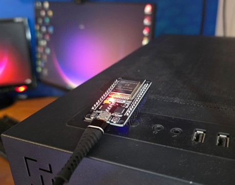
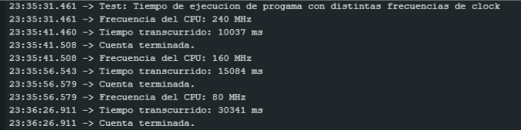

# Trabajo Práctico N°1: 
## Parte I - RENDIMIENTO

**Nombres**  
_Jorge A. Arbach_; _Bianca A. Fraga_;  _José I. López Sivilat_.


**Grupo**: BJJ
**Universidad Nacional de Córdoba**  
**Sistemas de Computación**

**Fecha** 17/03/2025   

---

### Información de los autores
 
- **Información de contacto**: _jorge.arbach@mi.unc.edu.ar_; 
_bianca.fraga@mi.unc.edu.ar_;
_jose.lopez.sivilat@mi.unc.edu.ar_;

---

# Introducción

El siguiente informe tiene como objetivo analizar y responder una serie de preguntas relacionadas con el uso de benchmarks y el rendimiento de procesadores en tareas específicas. A través de este análisis, se busca comprender cómo los benchmarks pueden ser herramientas útiles para medir y optimizar las tareas diarias, así como evaluar el desempeño de diferentes procesadores en la compilación del kernel de Linux. Además, se incluirán capturas de pantalla como evidencia de la realización del tutorial de **time profiling**, junto con las conclusiones obtenidas sobre el uso del tiempo en las funciones. 

---

# Desarrollo

## Benchmarks
### 1. Lista de Benchmarks

Para evaluar el rendimiento del sistema en función de las tareas que realizamos a diario, podemos considerar los siguientes benchmarks:  

#### **Benchmarks Útiles para el Desarrollo de Software (Compilación, Testing, Cobertura, Profiling, etc.)**  
- **Phoronix Test Suite** – Suite de pruebas para desarrollo.  
- **Clang-Bench y GCC Compile Bench** – Medición de tiempos de compilación.  
- **Valgrind & Heaptrack** – Análisis de memoria y detección de fugas.  

#### **Benchmarks Útiles para Redes y Comunicación (Sockets, Latencia, Transferencia de Datos, etc.)**  
- **iperf3** – Medición de ancho de banda y latencia de red.  
- **Netperf** – Evaluación del rendimiento de TCP y UDP.  

#### **Benchmarks Útiles para Servidores y Procesamiento de Datos**  
- **Sysbench** – Evaluación de CPU, memoria y bases de datos.  
- **fio** – Benchmark de almacenamiento (lectura/escritura en disco).  

#### **Benchmarks Útiles para Gaming y Gráficos**  
- **3DMark** – Mide rendimiento gráfico y de CPU en juegos.  
- **MSI Afterburner & CapFrameX** – Monitoreo de FPS y latencias en juegos.  
- **Cinebench R23** – Prueba de CPU en renderizado 3D.  
- **PugetBench for Adobe Suite** – Benchmark para edición de video y diseño gráfico.  

#### **Benchmarks Útiles para el Uso Cotidiano y Productividad**  
- **PCMark 10 (Productivity)** – Evalúa tareas de oficina como Office, navegación y multitarea.  
- **UL Procyon Office Benchmark** – Mide rendimiento en Microsoft Office (Word, Excel, PowerPoint).  
- **Speedometer 2.0** – Benchmark para evaluar la rapidez de navegación web.  
- **MotionMark** – Evalúa el rendimiento gráfico en navegadores.  
- **YouTube Playback Benchmark** – Mide rendimiento en reproducción de video.  

### 2. Benchmarks para el día a día

| **Tarea**                                    | **Benchmark Adecuado**                     |  
|----------------------------------------------|--------------------------------------------|  
| **Redes y Comunicación**                     |                                            |  
| Simulación de tráfico y carga en la red      | Pktgen, Netperf                           |  
| **Servidores y Almacenamiento**              |                                            |  
| Rendimiento de almacenamiento en disco       | fio, SPEC Storage, CrystalDiskMark        |  
| **Gaming y Gráficos**                        |                                            |  
| Evaluación de rendimiento en videojuegos     | 3DMark, Unigine Superposition, GFXBench   |  
| Medición de FPS y latencias en juegos        | MSI Afterburner, CapFrameX                |  
| **Renderizado y Diseño 3D**                  |                                            |  
| Edición de video y gráficos                  | PugetBench for Adobe Suite                |  
| **Uso Cotidiano y Productividad**            |                                            |  
| Rendimiento en Microsoft Office (Word, Excel, PowerPoint) | PCMark 10 (Productivity), UL Procyon Office Benchmark |  
| Navegación web (Chrome, Edge, Firefox)       | Speedometer 2.0, JetStream 2, MotionMark  |  
| Multitarea y aplicaciones de oficina         | PCMark 10 (Digital Content Creation)      |  
| Reproducción de video y streaming            | UL Procyon Video Editing, YouTube Playback Benchmark |  
| Consumo energético y autonomía de batería    | MobileMark 25, SPEC Power                 |  

### 3. Rendimiento de los Procesadores para Compilar el Kernel de Linux  

El rendimiento de un sistema es la capacidad que tiene este para realizar la tarea en un determinado tiempo, por lo tanto es necesario contar con los tiempos de ejecución de la tarea para poder calcularlo.

Usando los datos proporcionados en el enlace de referencia [1] y teniendo en cuenta que nos vamos a valer del rendimiento absoluto para calcular la aceleración o speedup:

$$ \text{Rendimiento} = \frac{1}{T} $$

Podemos armar la siguiente tabla:


| Procesador          | Tiempo (s) | Rendimiento absoluto (1/s) |
|---------------------|------------|--------------------|
| Intel i5-13600K    | 83 ± 3     | 0.012             |
| AMD Ryzen 9 5900X  | 97 ± 6     | 0.010             |
| AMD Ryzen 9 7950X  | 53 ± 3     | 0.019             |


Para calcular la aceleración del **AMD Ryzen 9 7950X 16-Core** en comparación con los otros procesadores, usamos la fórmula:  

$$ \text{Speedup} = \frac{Rendimiento Mejorado}{Rendimiento Base} $$

Y como sabemos que el rendimiento, en cuanto a tiempo de compilación, del procesador Ryzen 9 7950X es el mayor de los tres, la fórmula adquiere la siguiente expresión:

$$ \text{Speedup} = \frac{R_{\text{Ryzen 9 7950X}}}{R_{\text{procesador base}}} $$

o, análogamente: 

$$ \text{Speedup} = \frac{T_{\text{procesador base}}}{T_{\text{Ryzen 9 7950X}}} $$

#### **Comparación con Intel Core i5-13600K**  

$$ \text{Speedup} = \frac{83}{53} = 1.566 $$

#### **Comparación con AMD Ryzen 9 5900X**  

$$ \text{Speedup} = \frac{97}{53} = 1.830 $$


#### 4. Aceleración del AMD Ryzen 9 7950X 16-Core  

- El **Ryzen 9 7950X** es aproximadamente **1.57 veces más rápido** que el **i5-13600K** y **1.83 veces más rápido** que el **Ryzen 9 5900X** al compilar el kernel de Linux.  
- Su eficiencia energética (rendimiento por watt) también es la más alta, lo que lo hace más adecuado para tareas intensivas como compilación y servidores.  
- Su balance entre rendimiento y eficiencia refuerza su posición como uno de los procesadores más competitivos para tareas de alto consumo computacional, demostrando ser una inversión sólida tanto en términos de velocidad como de economía de energía.

## Práctica con el ESP32

Teóricamente, **si se duplica la frecuencia del procesador, el tiempo de ejecución del programa debería de reducirse aproximadamente a la mitad**, debido a que el procesador puede realizar más operaciones por segundo. Esto se basa en el principio de que el rendimiento de un procesador está directamente relacionado con su frecuencia de reloj. 

Sin embargo, hay ciertos factores que podrían influir en el resultado y afectar el tiempo de ejecución:

1. **Latencia y ancho de banda de la memoria:** Si el código implica frecuentes accesos a memoria, el rendimiento podría estar limitado por la velocidad de la RAM más que por la frecuencia del procesador. Esto se lo conoce como *“cuello de botella en la memoria”*

2. **Optimización del código:** Código no optimizado puede generar operaciones redundantes o poco eficientes que no aprovechan completamente el incremento de frecuencia. 

3. **Eficiencia de la arquitectura del procesador:** Algunas arquitecturas están diseñadas para realizar más operaciones por ciclo, independientemente de la frecuencia. 

4. **Paralelización:** Si el código no aprovecha los múltiples núcleos del procesador, el aumento en frecuencia beneficiará solo a un núcleo, limitando la mejora.

5. **Consumo de energía y gestión térmica:** Al aumentar la frecuencia, el procesador genera más calor y consume más energía. Si la temperatura sube demasiado, el procesador podría reducir automáticamente su frecuencia para protegerse, anulando las mejoras. 

6. **Efecto de caché:** Los procesadores modernos tienen múltiples niveles de memoria caché. Si los datos y las instrucciones del programa están bien optimizados para aprovechar el caché, el aumento de frecuencia será más efectivo. De lo contrario, se pierde tiempo accediendo a la memoria principal. 

**Pruebas en ESP32**

En este experimento, la idea es observar cómo cambia el tiempo de ejecución de un programa cuando se modifica la frecuencia del procesador.



Con este objetivo, a continuación, se ejecuta un programa en una ESP32 que realiza una serie de operaciones diseñadas para tardar aproximadamente 10 segundos con una frecuencia de reloj de 240 MHz. Luego, el mismo código se ejecuta con frecuencias de 160 MHz y 80 MHz para observar cómo varía el tiempo de ejecución.

```cpp
void setup() {
    Serial.begin(115200);
    delay(1000); // Pequeño delay para estabilidad

    unsigned long startTime, endTime; // Variables para medir el tiempo

    // Probar diferentes frecuencias de CPU
    int freqs[] = {240, 160, 80};
    Serial.println("Test: Tiempo de ejecución de programa con distintas frecuencias de clock");

    for (int i = 0; i < 3; i++) {
        setCpuFrequencyMhz(freqs[i]); // Cambia la frecuencia del CPU

        // Mostrar la frecuencia actual
        Serial.print("Frecuencia del CPU: ");
        Serial.print(getCpuFrequencyMhz());
        Serial.println(" MHz");

        // Medir el tiempo antes de iniciar la cuenta
        startTime = millis();

        // Cuenta hasta 12,631,578 ciclos
        volatile unsigned long count = 0;
        while (count < 126315789) {
            count++;
        }

        // Medir el tiempo al finalizar
        endTime = millis();

        // Mostrar el tiempo que tardó en completarse el conteo
        Serial.print("Tiempo transcurrido: ");
        Serial.print(endTime - startTime);
        Serial.println(" ms");

        Serial.println("Cuenta terminada.");
    }
}

void loop() {
    // No hace nada
}
```

Como mencionamos en un principio, si duplicamos la frecuencia del procesador, esperamos que el tiempo de ejecución se reduzca aproximadamente a la mitad, asumiendo que la tarea es completamente dependiente de la CPU y no hay otros factores limitantes como acceso a memoria o latencias externas. Si la frecuencia del procesador se reduce a la mitad, el tiempo de ejecución debería duplicarse. Es decir, a 160 MHz, el programa debería tardar aproximadamente 15 segundos, y a 80 MHz, cerca de 30 segundos.

**Resultados**





Como podemos ver, los resultados obtenidos siguen la hipótesis de que duplicar la frecuencia del procesador reduce aproximadamente a la mitad el tiempo de ejecución.

Los resultados obtenidos permiten comprobar las premisas teóricas de la relación lineal entre el tiempo de ejecución y la frecuencia del reloj. Esto es lo que esperaríamos bajo una suposición ideal donde la carga de trabajo es puramente computacional y no hay otros factores limitantes. Sin embargo, en la práctica, esta relación no es exacta debido a los diversos factores mencionados previamente. 


## Time Profiling 

---

# Conclusión

# Referencias
- [1] Phoronix Test Suite. (n.d.). PTS Build Linux Kernel 1.15.0. OpenBenchmarking. https://openbenchmarking.org/test/pts/build-linux-kernel-1.15.0
