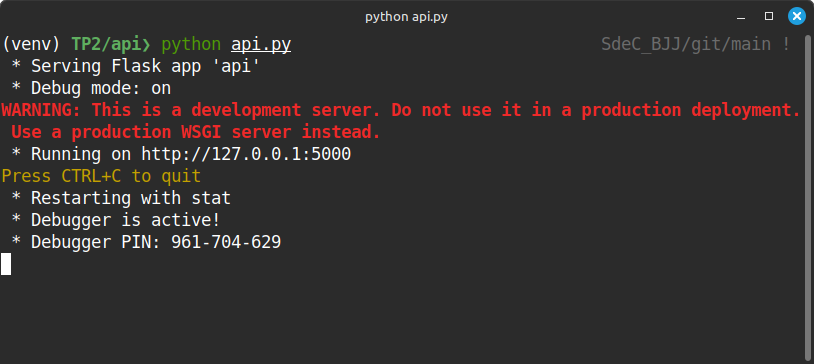
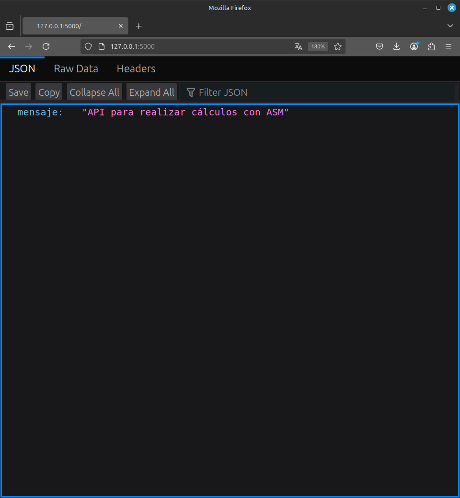
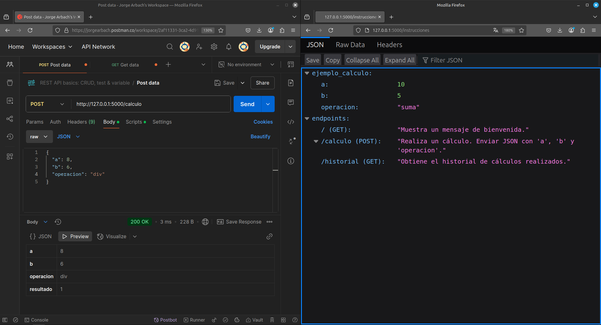
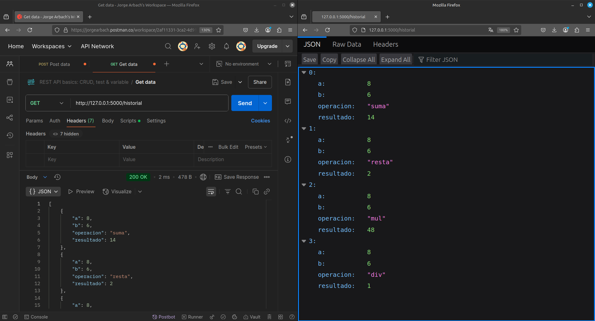

# Trabajo Práctico N°2: 
## STACK FRAME

**Nombres**  
_Jorge A. Arbach_; _Bianca A. Fraga_;  _José I. López Sivilat_.


**Grupo**: BJJ
**Universidad Nacional de Córdoba**  
**Sistemas de Computación**

**Fecha** 21/04/2025   

---

### Información de los autores
 
- **Información de contacto**: _jorge.arbach@mi.unc.edu.ar_; 
_bianca.fraga@mi.unc.edu.ar_;
_jose.lopez.sivilat@mi.unc.edu.ar_.

---

# Introducción
El presente informe documenta el desarrollo de un sistema de cálculo aritmético que integra diversas tecnologías de software, combinando una API REST desarrollada en Python (usando Flask), una capa intermedia en lenguaje C y rutinas de cálculo implementadas en lenguaje ensamblador para arquitectura x86-64. 

El objetivo principal del proyecto es aplicar conceptos de integración entre lenguajes de alto y bajo nivel, con un enfoque especial en la utilización del stack para el paso de parámetros y la recuperación de resultados, conforme a las convenciones de llamada de funciones.

Este sistema tiene aplicaciones prácticas en escenarios que requieren optimización de recursos o un rendimiento elevado, y busca fomentar la comprensión de conceptos fundamentales, como las convenciones ABI y el manejo del stack.

Este informe pretende ser una guía detallada del diseño, implementación y pruebas realizadas, brindando una visión completa del proceso de desarrollo y el potencial educativo y práctico de esta solución.

---

# Desarrollo


## Estructura del Proyecto

El proyecto está organizado en el siguiente esquema de directorios:

```
Stack_Frame/
├── api/
│   └── api.py
├── c_assembler/
│   ├── operaciones.asm
│   └── main.c
├── CMakeLists.txt
```

## Paso a Paso de la Implementación

### 1. Creación del entorno virtual y configuración de Flask

```bash
python3 -m venv venv
source venv/bin/activate
pip install flask
```

### 2. API REST en Flask (`api/api.py`)

La implementación de la API REST en Flask constituye el núcleo de la interacción entre el usuario y el sistema de cálculo. En este componente, se define un endpoint `POST /calculo` que recibe como entrada un JSON con los valores `a`, `b` y el tipo de `operacion` (suma, resta, mul, division). Este endpoint se encarga de procesar los datos ingresados y de invocar al binario `calcular`, el cual lleva a cabo las operaciones solicitadas.

```python
@app.route('/calculo', methods=['POST'])
def hacer_calculo():
    data = request.get_json()
    a = str(data['a'])
    b = str(data['b'])
    operacion = data['operacion']
    resultado = subprocess.run(["../c_asm/calcular", a, b, operacion], ...)
```

### 3. Rutinas en Ensamblador (`c_assembler/operaciones.asm`)

Las rutinas en ensamblador son la base de las operaciones aritméticas en el sistema, aprovechando el stack para el paso de parámetros y la gestión eficiente de los registros.
Cada operación está diseñada siguiendo las convenciones de llamada de funciones para la arquitectura x86-64.

**Ejemplo de suma:** Esta implementación utiliza el registro `rax` para almacenar el resultado, y las variables de entrada se reciben en los registros `rdi` y `rsi`. Se preserva el estado de `rbp` para mantener la coherencia del stack. A continuación se realiza una suma básica: 

```asm
suma:
    push rbp
    mov rbp, rsp
    mov rax, rdi
    add rax, rsi
    pop rbp
    ret
```

### 4. Compilación con Cmake (`CMakeLists.txt`)

La compilación del proyecto se realiza utilizando CMake, que permite gestionar de forma eficiente el proceso de construcción. Los comandos mencionados crean un directorio para los archivos de compilación (`build`) y ejecutan las instrucciones necesarias para generar los binarios del proyecto.

Es recomendable verificar que todas las dependencias estén correctamente configuradas antes de ejecutar estos comandos, asegurando así que CMake detecte los archivos fuente y el ensamblador sin problemas.

```bash
mkdir build
cd build
cmake ..
make
```

### 5. Ejecución de la API

La ejecución de la API marca el inicio de la interacción del usuario con el sistema. Para iniciarla, simplemente navega al directorio `api` y utiliza el comando `python api.py`. Esto pondrá en funcionamiento el servidor Flask en el puerto predeterminado (`127.0.0.1:5000`), listo para recibir solicitudes.

```bash
cd api
python api.py
```






### 6. Pruebas con Postman

Las pruebas con Postman son esenciales para validar el funcionamiento de la API y verificar que los puntos finales responden correctamente a las solicitudes. Este proceso incluye enviar datos estructurados en formato JSON al punto final `/calculo` y analizar la respuesta esperada, garantizando que las operaciones aritméticas sean precisas.

- URL: `http://127.0.0.1:5000/calculo`
- Método: `POST`
- Body (JSON):
```json
{
  "a": 15,
  "b": 5,
  "operacion": "div"
}
```
- Respuesta esperada:
```json
{
  "a": 15,
  "b": 5,
  "operacion": "div",
  "resultado": 3
}
```




- URL: `http://127.0.0.1:5000/instrucciones`
- Método: `GET`
- Respuesta esperada:
```json
"endpoints": {
    "/calculo (POST)": "Realiza un cálculo. Enviar JSON con 'a', 'b' y 'operacion'.",
    "/historial (GET)": "Obtiene el historial de cálculos realizados.",
    "/ (GET)": "Muestra un mensaje de bienvenida."
},
"ejemplo_calculo": {
    "a": 10,
    "b": 5,
    "operacion": "suma"
}
```



---

# Conclusión

El proyecto demostró la viabilidad de integrar diferentes lenguajes y paradigmas (alto y bajo nivel) en un entorno coordinado y funcional. La utilización del stack para pasar parámetros entre C y ensamblador fue exitosa, cumpliendo con las convenciones del sistema operativo y facilitando una arquitectura modular y extensible.

La arquitectura basada en una API REST proporcionó una separación clara entre la lógica de negocio y la interfaz de usuario, lo que habilita su reutilización y expansión futura. Además, esta estructura facilita el mantenimiento y la integración de nuevos puntos finales, mejorando la flexibilidad del sistema en diferentes entornos de uso.

La utilización de herramientas modernas como Postman fue clave para validar y depurar el sistema, permitiendo identificar y corregir posibles errores de manera eficiente. Estas pruebas aseguraron la precisión de las operaciones implementadas y verificaron la consistencia de las respuestas de la API frente a diferentes casos de uso.

En conclusión, este proyecto no solo cumplió con sus objetivos técnicos, sino que también proporcionó un marco para entender y aplicar conceptos fundamentales de integración entre lenguajes, manejo de bajo nivel y diseño de arquitecturas modernas. Esta experiencia puede servir como base para proyectos futuros que busquen optimizar recursos, ampliar la funcionalidad existente o explorar nuevas aplicaciones tecnológicas.

# Referencias

- API Integration in Python. Recuperado de https://realpython.com/api-integration-in-python/
- Postman. Recuperado de https://www.postman.com/
