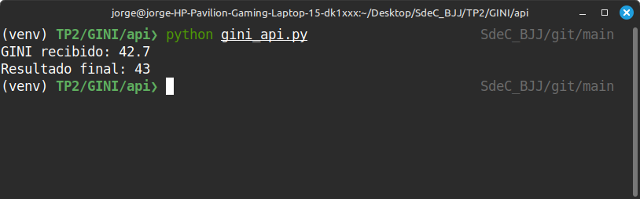
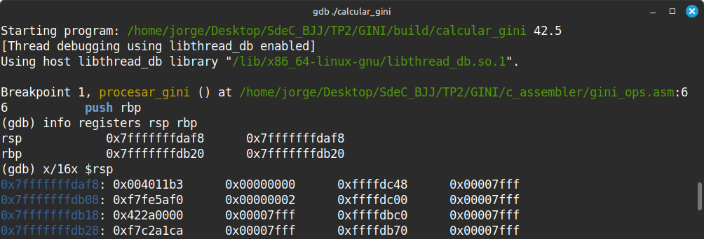
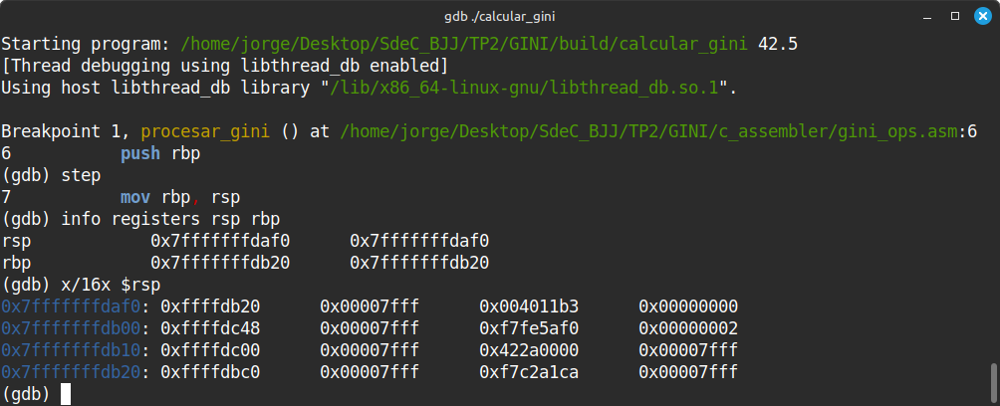
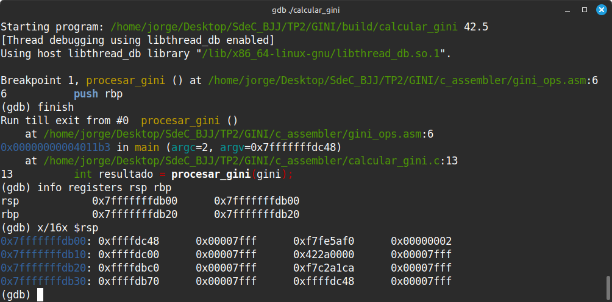

# Trabajo Práctico N°2: 
## STACK FRAME

**Nombres**  
_Jorge A. Arbach_; _Bianca A. Fraga_;  _José I. López Sivilat_.


**Grupo**: BJJ
**Universidad Nacional de Córdoba**  
**Sistemas de Computación**

**Fecha** 21/04/2025   

---

### Información de los autores
 
- **Información de contacto**: _jorge.arbach@mi.unc.edu.ar_; 
_bianca.fraga@mi.unc.edu.ar_;
_jose.lopez.sivilat@mi.unc.edu.ar_.

---

# Introducción
El presente informe documenta, en una primera parte, el desarrollo de un sistema de cálculo aritmético que integra diversas tecnologías de software, combinando una API REST desarrollada en Python (usando Flask), una capa intermedia en lenguaje C y rutinas de cálculo implementadas en lenguaje ensamblador para arquitectura x86-64. 

En una segunda parte se buscará implementar un sistema de cálculo del índice GINI utilizando la misma arquitectura por capas. La capa superior, desarrollada en Python, se encarga de recuperar datos desde una API REST del Banco Mundial. Los datos obtenidos son procesados por una capa intermedia en lenguaje C, que a su vez delega cálculos críticos a rutinas en lenguaje ensamblador. Estas rutinas hacen uso explícito del stack para pasar parámetros y devolver resultados, permitiendo una exploración detallada del comportamiento a bajo nivel mediante herramientas como GDB.

El objetivo principal del proyecto es aplicar conceptos de integración entre lenguajes de alto y bajo nivel, con un enfoque especial en la utilización del stack para el paso de parámetros y la recuperación de resultados, conforme a las convenciones de llamada de funciones.

Este sistema tiene aplicaciones prácticas en escenarios que requieren optimización de recursos o un rendimiento elevado, y busca fomentar la comprensión de conceptos fundamentales, como las convenciones ABI y el manejo del stack.

Este informe pretende ser una guía detallada del diseño, implementación y pruebas realizadas, brindando una visión completa del proceso de desarrollo y el potencial educativo y práctico de esta solución.

---

# Desarrollo
# **Parte I - Calculadora Básica**

## Estructura del Proyecto

El proyecto está organizado en el siguiente esquema de directorios:

```
Stack_Frame/
├── api/
│   └── api.py
├── c_assembler/
│   ├── operaciones.asm
│   └── main.c
├── CMakeLists.txt
```

## Paso a Paso de la Implementación

### 1. Creación del entorno virtual y configuración de Flask

```bash
python3 -m venv venv
source venv/bin/activate
pip install flask
```

### 2. API REST en Flask (`api/api.py`)

La implementación de la API REST en Flask constituye el núcleo de la interacción entre el usuario y el sistema de cálculo. En este componente, se define un endpoint `POST /calculo` que recibe como entrada un JSON con los valores `a`, `b` y el tipo de `operacion` (suma, resta, mul, division). Este endpoint se encarga de procesar los datos ingresados y de invocar al binario `calcular`, el cual lleva a cabo las operaciones solicitadas.

```python
@app.route('/calculo', methods=['POST'])
def hacer_calculo():
    data = request.get_json()
    a = str(data['a'])
    b = str(data['b'])
    operacion = data['operacion']
    resultado = subprocess.run(["../c_asm/calcular", a, b, operacion], ...)
```

### 3. Rutinas en Ensamblador (`c_assembler/operaciones.asm`)

Este apartado documenta las funciones aritméticas implementadas en lenguaje ensamblador para la arquitectura x86-64. Estas rutinas forman parte del núcleo del proyecto y permiten realizar operaciones básicas de manera eficiente, aprovechando la manipulación directa de registros y siguiendo la convención de llamada de funciones estándar, lo cual facilita su integración con código en C.

Las funciones definidas son `suma`, `resta`, `mul` y `division`, y utilizan los registros `rdi` y `rsi` para recibir parámetros, devolviendo el resultado en `rax`.

```asm
global suma, resta, mul, division

section .text

suma:               ; int suma(int a, int b)
    mov rax, rdi    ; rax = a
    add rax, rsi    ; rax += b
    ret

resta:              ; int resta(int a, int b)
    mov rax, rdi    ; rax = a
    sub rax, rsi    ; rax -= b
    ret

mul:                ; int mul(int a, int b)
    mov rax, rdi    ; rax = a
    imul rsi        ; rax *= b (multiplicación con signo)
    ret

division:           ; int division(int a, int b)
    mov rax, rdi    ; rax = a (dividendo)
    cqo             ; extiende el signo de rax a rdx para dividir
    idiv rsi        ; rax = a / b (división con signo)
    ret
```

### 4. Código en C (`c_assembler/main.c`)

El siguiente código en C actúa como interfaz principal para interactuar con las rutinas aritméticas implementadas en lenguaje ensamblador. A través de este programa, se recibe entrada desde la línea de comandos, se interpreta la operación solicitada, y se llama a la función correspondiente implementada en ensamblador.

```c
#include <stdio.h>
#include <stdlib.h>
#include <string.h>

// Declaración de funciones externas implementadas en ensamblador
extern long suma(long a, long b);
extern long resta(long a, long b);
extern long mul(long a, long b);
extern long division(long a, long b);

int main(int argc, char *argv[]) {
    if (argc < 4) {
        printf("Uso: %s <a> <b> <operacion>\n", argv[0]);
        return 1;
    }

    long a = atol(argv[1]);      // Conversión del primer argumento a número entero
    long b = atol(argv[2]);      // Conversión del segundo argumento a número entero
    char *op = argv[3];          // Tercer argumento: tipo de operación a realizar
    long res = 0;

    // Comparación de la operación solicitada y llamada a la rutina correspondiente
    if (strcmp(op, "suma") == 0)
        res = suma(a, b);
    else if (strcmp(op, "resta") == 0)
        res = resta(a, b);
    else if (strcmp(op, "mul") == 0)
        res = mul(a, b);
    else if (strcmp(op, "div") == 0)
        res = division(a, b);
    else {
        printf("Operación no válida.\n");
        return 1;
    }

    // Muestra el resultado en consola
    printf("%ld\n", res);
    return 0;
}
```

### 5. Compilación con Cmake (`CMakeLists.txt`)

La compilación del proyecto se realiza utilizando CMake, que permite gestionar de forma eficiente el proceso de construcción. Los comandos mencionados crean un directorio para los archivos de compilación (`build`) y ejecutan las instrucciones necesarias para generar los binarios del proyecto.

Es recomendable verificar que todas las dependencias estén correctamente configuradas antes de ejecutar estos comandos, asegurando así que CMake detecte los archivos fuente y el ensamblador sin problemas.

```bash
mkdir build
cd build
cmake ..
make
```

### 6. Ejecución de la API

La ejecución de la API marca el inicio de la interacción del usuario con el sistema. Para iniciarla, simplemente navega al directorio `api` y utiliza el comando `python api.py`. Esto pondrá en funcionamiento el servidor Flask en el puerto predeterminado (`127.0.0.1:5000`), listo para recibir solicitudes.

```bash
cd api
python api.py
```


### 7. Pruebas con Postman

Las pruebas con Postman son esenciales para validar el funcionamiento de la API y verificar que los puntos finales responden correctamente a las solicitudes. Este proceso incluye enviar datos estructurados en formato JSON al punto final `/calculo` y analizar la respuesta esperada, garantizando que las operaciones aritméticas sean precisas.

- URL: `http://127.0.0.1:5000/calculo`
- Método: `POST`
- Body (JSON):
```json
{
  "a": 15,
  "b": 5,
  "operacion": "div"
}
```
- Respuesta esperada:
```json
{
  "a": 15,
  "b": 5,
  "operacion": "div",
  "resultado": 3
}
```


- URL: `http://127.0.0.1:5000/instrucciones`
- Método: `GET`
- Respuesta esperada:
```json
"endpoints": {
    "/calculo (POST)": "Realiza un cálculo. Enviar JSON con 'a', 'b' y 'operacion'.",
    "/historial (GET)": "Obtiene el historial de cálculos realizados.",
    "/ (GET)": "Muestra un mensaje de bienvenida."
},
"ejemplo_calculo": {
    "a": 10,
    "b": 5,
    "operacion": "suma"
}
```


# **Parte II - Calculadora GINI**
## Estructura del Proyecto

El proyecto está organizado de manera idéntica a la primera parte:

```
GINI/
├── api/
│   └── gini_api.py
├── c_assembler/
│   ├── ginig_ops.asm
│   └── calcular_gini.c
├── CMakeLists.txt
```

## Paso a Paso de la Implementación
### 1. Obtención de datos desde API REST (Python)

Se utiliza la biblioteca `requests` de Python para consultar el índice GINI de un país específico (ej. Argentina) en el rango de años 2011-2020.

**Archivo**: `api/gini_api.py`

```python
url = "https://api.worldbank.org/v2/en/country/ARG/indicator/SI.POV.GINI?format=json&date=2011:2020"
response = requests.get(url)
data = response.json()
```

El script extrae el primer valor no nulo y lo pasa como argumento al ejecutable en C mediante `subprocess.run()`.

```python
subprocess.run(["../build/calcular_gini", str(gini)], ...)
```

---

### 2. Paso de datos a la capa intermedia en C

**Archivo**: `c_assembler/calcular_gini.c`

La función principal convierte el argumento recibido (float) y lo pasa a la función en ensamblador que hace el cálculo.

```c
extern int procesar_gini(float valor);

int main(int argc, char *argv[]) {
    float gini = atof(argv[1]);
    int resultado = procesar_gini(gini);
    printf("%d\n", resultado);
    return 0;
}
```

### 3. Implementación de rutina en ensamblador

**Archivo**: `c_assebmbler/gini_ops.asm`

```asm
section .text
global procesar_gini

procesar_gini:
    push rbp
    mov rbp, rsp

    ; Convertir float en xmm0 a int en eax (truncamiento)
    cvttss2si eax, xmm0
    add eax, 1

    pop rbp
    ret
```

Esta función utiliza el registro `xmm0` para recibir el valor `float`, lo convierte a `int` con `cvttss2si`, le suma uno, y devuelve el resultado en `eax`.


### 4. Compilación y generación del ejecutable

**Archivo**: `/CMakeLists.txt`

Este archivo incluye las opciones de depuración necesarias tanto para NASM como para GCC, las cuales son ejecutadas al momento de compilar el projecto con cmake.

```
nasm -f elf64 -g -F dwarf ${CMAKE_SOURCE_DIR}/c_assembler/gini_ops.asm -o ${CMAKE_BINARY_DIR}/gini_ops.o

gcc -g -c ${CMAKE_SOURCE_DIR}/c_assembler/calcular_gini.c -o ${CMAKE_BINARY_DIR}/calcular_gini.o
```



En la _figura 5_, se muestra la ejecución de un proceso informático en un entorno virtual activo, identificado como `venv`. El entorno virtual permite aislar las dependencias del proyecto, garantizando compatibilidad y control sobre los paquetes instalados.

El comando ejecutado es `python gini_api.py`, cuyo propósito es iniciar el archivo Python denominado `gini_api.py`. Este archivo está diseñado para procesar información relacionada con un valor GINI. El proceso se desarrolla en las siguientes etapas:

* **Recepción del valor GINI:** El programa obtiene el índice de Gini desde la API del Banco Mundial, analizando los datos hasta encontrar el primer valor válido.

* **Procesamiento del valor:** El valor recibido, 42.7, se envía a un programa en C que realiza un ajuste o transformación, aumentando el valor a 43.

* **Generación del resultado final:** Tras el procesamiento, el programa entrega el valor ajustado como resultado final, que se muestra en la terminal.

### 5. Análisis del stack con GDB

Se utilizaron los siguientes comandos en GDB para depurar la ejecución y observar el uso del stack:

```bash
gdb ./calcular_gini
```

#### Estado del Stack:

Durante el análisis de la función `procesar_gini`, se pueden observar las siguientes transiciones en el stack:
- **Antes de la llamada**:
  - El programa en C llama a `procesar_gini(gini)` pasando el valor `float` por el registro `xmm0` (conforme a la convención de llamadas System V AMD64).
  - El stack contiene el valor de retorno de la función `main` y posibles valores temporales o variables automáticas.
  - `$rsp` apunta al retorno desde `main()`.




- **Durante la ejecución de la función ASM**:
  - Se ejecuta `push rbp`, almacenando el valor actual del *frame pointer*.
  - `$rsp` decrece con `push rbp` y apunta al valor antiguo de `rbp`.
  - Luego `mov rbp, rsp` establece un nuevo marco de pila para la función.
  - No se realiza reserva de espacio adicional ya que los datos se manejan vía registros (`xmm0` y `eax`).
  - El stack permanece estable, con `rbp` apuntando al marco de esta función y `rsp` inmediatamente por debajo.




- **Después de la ejecución**:
  - Se realiza `pop rbp`, restaurando el marco anterior.
  - `ret` extrae la dirección de retorno desde el tope del stack.
  - El stack queda tal como estaba antes de la llamada, asegurando la integridad del flujo del programa.



Antes de la función:
[rsp] -> [ dirección de retorno ]

Durante la función:
[rsp] -> [ antiguo rbp ]
         [ dirección de retorno ]

Después de la función:
[rsp] -> [ dirección de retorno de main ]

---

# Conclusión

El proyecto demostró la viabilidad de integrar diferentes lenguajes y paradigmas (alto y bajo nivel) en un entorno coordinado y funcional. La utilización del stack para pasar parámetros entre C y ensamblador fue exitosa, cumpliendo con las convenciones del sistema operativo y facilitando una arquitectura modular y extensible.

La arquitectura basada en una API REST proporcionó una separación clara entre la lógica de negocio y la interfaz de usuario, lo que habilita su reutilización y expansión futura. Además, esta estructura facilita el mantenimiento y la integración de nuevos puntos finales, mejorando la flexibilidad del sistema en diferentes entornos de uso.

La utilización de herramientas modernas como Postman fue clave para validar y depurar el sistema, permitiendo identificar y corregir posibles errores de manera eficiente. Estas pruebas aseguraron la precisión de las operaciones implementadas y verificaron la consistencia de las respuestas de la API frente a diferentes casos de uso.

Además, GDB fue una herramienta clave para visualizar y entender el uso de registros y el comportamiento del stack durante la ejecución del programa. Esta depuración mostró que el stack permanece limpio y correctamente gestionado antes, durante y después de cada llamada.

En conclusión, este proyecto no solo cumplió con sus objetivos técnicos, sino que también proporcionó un marco para entender y aplicar conceptos fundamentales de integración entre lenguajes, manejo de bajo nivel y diseño de arquitecturas modernas. 

# Referencias

- API Integration in Python. Recuperado de https://realpython.com/api-integration-in-python/
- Postman. Recuperado de https://www.postman.com/
- Banco Mundial - Indicador GINI. Recuperado de https://data.worldbank.org/indicator/SI.POV.GINI
