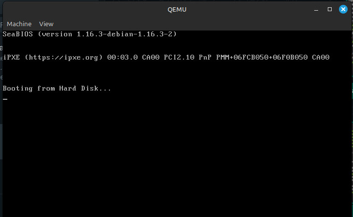
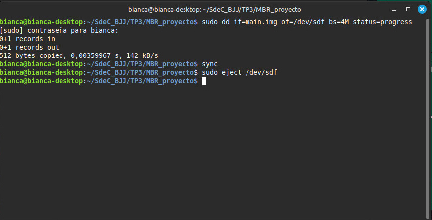

# Trabajo Práctico N°3: 
## MODO PROTEGIDO

**Nombres**  
_Jorge A. Arbach_; _Bianca A. Fraga_; _José I. López Sivilat_

**Grupo**: BJJ  
**Universidad Nacional de Córdoba**  
**Sistemas de Computación**

**Fecha**: 28/04/2025

---

### Información de los autores

- **Información de contacto**:  
  _jorge.arbach@mi.unc.edu.ar_;  
  _bianca.fraga@mi.unc.edu.ar_;  
  _jose.lopez.sivilat@mi.unc.edu.ar_.

---

# Introducción

Los procesadores x86 presentan una evolución en su forma de operar. Inicialmente trabajaban en **modo real**, donde las direcciones de memoria eran gestionadas de forma sencilla pero limitada. Con la introducción del **modo protegido**, se incorporaron mejoras fundamentales para la gestión de la memoria, la protección entre procesos y la posibilidad de trabajar con multitarea de forma más segura. Este modo introduce conceptos avanzados como segmentación, paginación y privilegios de ejecución, fundamentales en los sistemas modernos.

En este trabajo práctico se explorarán los conceptos asociados al modo protegido, respondiendo una serie de preguntas para afianzar los conocimientos teóricos.

---

# DESARROLLO

En primer lugar, debimos clonar un repositorio e iniciar los submódulos, tal como lo indica el README de dicho repositorio:

https://gitlab.com/sistemas-de-computacion-2021/protected-mode-sdc

Al ingresar a dicho enlace, nos encontramos con tres comandos a seguir:

```
git clone (url of this repo)
git submodule init
git submodule update
```
Y obtuvimos como resultado, lo siguiente: 


A continuación, se explica lo que significa cada comando:

* `git clone:` Descarga un repositorio completo desde una URL remota.
* `git submodule init:` Inicializa los submódulos en el repositorio. Los submódulos en Git son repositorios dentro de otros repositorios. A veces, un proyecto principal depende de otros proyectos más pequeños o módulos.
* `git submodule update:` Actualiza los submódulos a la última versión. Esto descargará los cambios más recientes en los submódulos y los vinculará correctamente al proyecto principal.

En la presentación de clase, tenemos el paso a paso de cómo hacer un **MBR (Master Boot Record)** con la creación de una imagen de disco con una instrucción `hlt`, tal como se muestra a continuación:


Donde el primer comando tiene la siguiente explicación: 

* `\364` en octal es equivalente a `0xf4` en hexadecimal, que representa la instrucción `hlt` en lenguaje ensamblador. La instrucción `hlt` detiene la ejecución del procesador.
* `%509s` producir 509 espacios en blanco. Esto es necesario para completar la imagen hasta el byte 510. Siendo que desde el byte 510 hasta el 511, es donde se almacena la firma de arranque.
* `\125\252` en octal es equivalente a `0x55 0xAA` en hexadecimal. Estos valores son requisitos para que la imagen sea interpretada como un registro maestro de arranque (MBR) válido.

## OBJETIVOS

**1. Correr la imagen: Instalar y correr qemu con la imagen en cuestión**

```
sudo apt install qemu-system-x86
qemu-system-x86_64 --drive file=main.img,format=raw,index=0,media=disk`
```


Una vez que ejecutamos dicho comando, obtuvimos como resultado lo siguiente:



Como conclusión de este primer objetivo, se desarrolló y probó un **Master Boot Record (MBR)** desde cero, utilizando instrucciones en ensamblador y herramientas como `as`, `objdump` y `hd`. A través de la creación de una imagen de disco (`main.img`) con una secuencia específica de bytes y la inclusión de la instrucción `hlt`, se exploró el proceso de configuración y prueba de un MBR funcional.

La ejecución en **QEMU** confirmó que la imagen de disco se carga correctamente, mostrando la secuencia de arranque con _SeaBIOS_ e _iPXE_ sin errores críticos. Esto valida que la imagen generada es reconocida por la máquina virtual.

**2. Ejecutar programas en el hardware: Grabar un pendrive con la imagen a probar, colocar el pen en la pc y colocar el pen en la pc encenderla e indicar que inicie desde la misma**



En nuestro caso específico, al iniciar el proceso de arranque desde la imagen creada, la pantalla permanece en negro y no muestra ninguna salida visual. Además, no es posible interactuar con el sistema a través del teclado, excepto mediante la combinación de `Ctrl + Alt + Supr`, que reinicia el equipo y lo devuelve al estado inicial. Si en ese punto no se elige manualmente una opción de booteo, el sistema procede a arrancar normalmente desde el sistema operativo instalado en el disco.

**3. UEFI y Coreboot**

* **¿Qué es UEFI? ¿Cómo puedo usarlo? Función de ejemplo.**

La **Unified Extensible Firmware Interface (UEFI)** es una especificación que define una interfaz entre el sistema operativo y el firmware. UEFI reemplaza la antigua BIOS tradicional, soporta particiones GPT, es independiente de la arquitectura de CPU y ofrece una interfaz gráfica amigable.

Para usar UEFI, se necesita:
- Una placa base compatible con UEFI.
- Un sistema operativo moderno compatible con UEFI.

**Pasos para acceder al firmware UEFI:**
1. Encender la computadora y presionar una tecla específica (F2, F10, F12, Esc o Supr) para iniciar la utilidad de configuración del BIOS durante el inicio.
2. Cuando aparezca la ventana inicial, seleccionar el menú de configuración y presionar Enter.
3. Dentro del menú de configuración, ir a la selección **Boot** o **Advanced Settings** y buscar la opción de **Boot Mode** o **UEFI/Legacy Boot**.
4. Cambiar el modo de arranque de **BIOS tradicional** a **UEFI**.
5. Para aplicar la configuración, se debe presionar **F10**, confirmar los cambis y reiniciar la compuadora.

**Función de ejemplo**: Desde UEFI se podría llamar a una función de arranque seguro (**Secure Boot**) para validar firmas de los sistemas operativos.

* **¿Casos de bugs de UEFI explotables**

Ha habido varios casos en los que vulnerabilidades en UEFI han sido explotadas para comprometer la seguridad del sistema. Algunos ejemplos son:

* SMM Callout (Privilege Escalation), donde código malicioso puede aprovechar el modo de gestión del sistema (SMM) para ejecutar instrucciones no autorizadas con el máximo privilegio. 

* LogoFAIL, permite modificar imágenes de logotipos en la partición EFI para ejecutar código malicioso antes de la carga del sistema operativo. Su impacto es que puede _bypassear_ protecciones (saltarse restricciones) como Secure Boot, permitiendo la instalación de malware persistente.

* Vulnerabilidades en laptops, donde investigadores de ESET descubrieron fallos en el firmware UEFI de varios modelos de computadoras como Lenovo. Su impacto es que un atacante con privilegios de administrador podría desactivar Secure Boot y modificar la memoria flash SPI, facilitando la instalación de malware a nivel de firmware.

Estos casos demuestran la importancia de mantener el firmware actualizado y aplicar medidas de seguridad como Secure Boot y análisis de integridad del sistema.

* **¿Qué es CSME y MEBx?**

**CSME (Converged Security and Management Engine)**: es un subsistema integrado en los procesadores modernos que gestiona funciones de seguridad y administración. Su propósito es garantizar la integridad del firmware y proteger el sistema desde el arranque. Además, se encarga de:

  - Inicialización del silicio: verifica la autenticidad del firmware y los componentes del sistema.
  - Administración remota y local del sistema: permite administrar dispositivos de manera segura.
  - Seguridad avanzada: protege contra ataques a nivel de hardware y previene accesos no autorizados.

**Intel MEBx (Management Engine BIOS Extension)**: es una interfaz dentro del BIOS que permite configurar y administrar tecnologías de seguridad y gestión remota en sistemas. Se encarga de:

  - Configuración de Intel AMT: permite activar y administrar la tecnología de gestión remota.
  - Cambio de contraseñas de administración: se usa para establecer credenciales seguras.
  - Control de arranque remoto: facilita el acceso y mantenimiento de equipos sin intervención física.

* **¿Qué es Coreboot? ¿Qué productos lo incorporan? ¿Ventajas?**

**Coreboot** (antes llamado LinuxBIOS) es un proyecto dirigido a reemplazar el firmware no libre de los BIOS propietarios, encontrados en la mayoría de los computadores, por un BIOS libre y ligero diseñado para realizar solamente el mínimo de tareas necesarias para cargar y correr un sistema operativo moderno de 32 bits o de 64 bits. 

Se integra en una variedad de productos, incluyendo computadoras portátiles, de escritorio, servidores y dispositivos embebidos, especialmente en _Chromebooks_ y otros productos de ChromeOS. También se utiliza en proyectos como _Libreboot_ y en algunas placas base de hardware libre.

**Productos que incorporan Coreboot**

* Dispositivos ChromeOS: todos los Chromebooks, Chromeboxes, Chromebits, etc., desde 2012. 
* Computadoras portátiles y de escritorio: algunas marcas como System76, StarLabs y Librem ofrecen opciones con Coreboot. 
* Placas base: ofrece soporte para algunas placas base de marca como Asus, Asrock, Gigabyte, MSI, entre otras. 
* Servidores: coreboot se utiliza para reducir el tiempo de arranque en servidores. 
* Dispositivos embebidos: también se puede utilizar en dispositivos con arquitecturas como ARM, ARM64 y RISC-V, así como en plataformas de software en un chip.

**Ventajas de su utilización**:
- Transparencia total: código abierto y auditable.
- Control sobre el hardware, sin restricciones de proveedores.
- Mayor seguridad y privacidad.
- Personalización flexible.

**Productos que lo incorporan**: Algunas Chromebooks, servidores de alta seguridad, y laptops de marcas especializadas en hardware libre como System76 o Purism.

**4. Pequeño "Hello world"**


## 2. Linker

### ¿Qué es un linker? ¿Qué hace?

Un **linker** es una herramienta utilizada para unir múltiples archivos objeto (.o) en un solo archivo ejecutable o en una biblioteca compartida. Su función principal es:
- Combinar archivos objeto.
- Resolver referencias cruzadas entre funciones y variables.

### ¿Qué es la dirección que aparece en el script del linker? ¿Por qué es necesaria?

En el script del linker suele aparecer la dirección **0x7C00**.  
Esta dirección es fundamental porque:
- El BIOS carga el primer sector de arranque de un disco exactamente en **0x7C00**.
- El código debe estar ubicado ahí para que, al encender el sistema, el BIOS transfiera correctamente el control de ejecución al cargador de arranque.

Si no se especifica correctamente esta dirección, el sistema no podrá arrancar de manera esperada.

---

# Conclusiones

El modo protegido representó un salto cualitativo en la arquitectura de los procesadores x86, permitiendo la implementación de sistemas operativos multitarea y seguros. Gracias a sus mecanismos de segmentación, paginación y control de privilegios, se logró una administración más eficiente y confiable de los recursos del sistema, sentando las bases de la computación moderna.

Asimismo, comprender el funcionamiento de tecnologías como UEFI, CSME y Coreboot, así como los procesos de linking a bajo nivel, resulta indispensable para entender el funcionamiento interno de los sistemas actuales y garantizar su seguridad y correcto desempeño.


