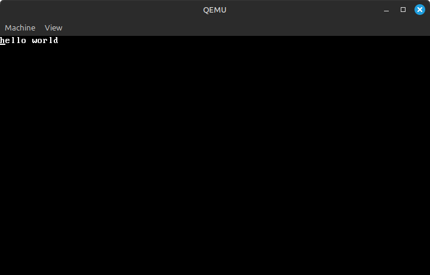

# Trabajo Práctico N°3: 
## MODO PROTEGIDO

**Nombres**  
_Jorge A. Arbach_; _Bianca A. Fraga_; _José I. López Sivilat_

**Grupo**: BJJ  
**Universidad Nacional de Córdoba**  
**Sistemas de Computación**

**Fecha**: 28/04/2025

---

### Información de los autores

- **Información de contacto**:  
  _jorge.arbach@mi.unc.edu.ar_;  
  _bianca.fraga@mi.unc.edu.ar_;  
  _jose.lopez.sivilat@mi.unc.edu.ar_.

---

# Introducción

Los procesadores x86 presentan una evolución en su forma de operar. Inicialmente trabajaban en **modo real**, donde las direcciones de memoria eran gestionadas de forma sencilla pero limitada. Con la introducción del **modo protegido**, se incorporaron mejoras fundamentales para la gestión de la memoria, la protección entre procesos y la posibilidad de trabajar con multitarea de forma más segura. Este modo introduce conceptos avanzados como segmentación, paginación y privilegios de ejecución, fundamentales en los sistemas modernos.

En este trabajo práctico se explorarán los conceptos asociados al modo protegido, respondiendo una serie de preguntas para afianzar los conocimientos teóricos.

---

# DESARROLLO

En primer lugar, debimos clonar un repositorio e iniciar los submódulos, tal como lo indica el README de dicho repositorio:

https://gitlab.com/sistemas-de-computacion-2021/protected-mode-sdc

Al ingresar a dicho enlace, nos encontramos con tres comandos a seguir:

```bash
git clone (url of this repo)
git submodule init
git submodule update
```


Una vez que se cuentan con todos los archivos del repositorio se puede comenzar con el desarrollo del trabajo práctico:

## **1. Crear y correr una imagen booteable**

En la presentación de clase, tenemos el paso a paso de cómo hacer un **MBR (Master Boot Record)** con la creación de una imagen de disco con una instrucción `hlt`, tal como se muestra a continuación:

```bash
printf '\364%509s\125\252' > main.img
```

Este comando para la creación de la imagen main.img está compuesta por: 

* `\364` en octal es equivalente a `0xf4` en hexadecimal, que representa la instrucción `hlt` en lenguaje ensamblador. La instrucción `hlt` detiene la ejecución del procesador.
* `%509s` producir 509 espacios en blanco. Esto es necesario para completar la imagen hasta el byte 510. Siendo que desde el byte 510 hasta el 511, es donde se almacena la firma de arranque.
* `\125\252` en octal es equivalente a `0x55 0xAA` en hexadecimal. Estos valores son requisitos para que la imagen sea interpretada como un registro maestro de arranque (MBR) válido.


Luego de haber creado este sector de arranque se procede a instalar y correr qemu con dicha imagen creada:

```bash
sudo apt install qemu-system-x86
qemu-system-x86_64 --drive file=main.img,format=raw,index=0,media=disk`
```

Una vez que ejecutamos dicho comando, obtuvimos como resultado lo siguiente:


Como conclusión de este primer objetivo, se desarrolló y probó un **Master Boot Record (MBR)** desde cero, utilizando instrucciones en ensamblador y herramientas como `as`, `objdump` y `hd`. A través de la creación de una imagen de disco (`main.img`) con una secuencia específica de bytes y la inclusión de la instrucción `hlt`, se exploró el proceso de configuración y prueba de un MBR funcional.

La ejecución en **QEMU** confirmó que la imagen de disco se carga correctamente, mostrando la secuencia de arranque con _SeaBIOS_ e _iPXE_ sin errores críticos. Esto valida que la imagen generada es reconocida por la máquina virtual.


## **2. Grabar la imagen y correrla en HW real**

Para grabar la imagen de disco de manera precisa, se recomienda utilizar el comando `dd`, ya que permite realizar una copia bit a bit desde un archivo de imagen hacia un dispositivo físico (como un pendrive). En este caso, será necesario escribir los primeros **512 bytes** del archivo en el dispositivo de destino.  

Antes de ejecutar el comando, debemos asegurarnos de identificar correctamente el dispositivo destino para evitar sobrescribir datos.  

Por este motivo, en primer lugar se debe determinar cual es el driver asignado al dispositivo o pen-drive que se quiere grabar la imagen. Para ello se usará el comando fdisk en combinación con grep para listar solamente las unidades de tipo disco.

```bash
sudo fdisk -l | grep sd
```  


De esta manera, se identifica que `/dev/sdc1` es el dispositivo buscado, un pendrive de 8 Gb.

Ya identificado el dispositivo se procede a grabar la imagen. 


Luego de grabar la imagen debemos reiniciar la PC e indicarle que arranque desde el usb booteado para que corra dicha imagen.En nuestro caso específico, al iniciar el proceso de arranque desde la imagen creada, la pantalla permanece en negro y no muestra ninguna salida visual. Además, no es posible interactuar con el sistema a través del teclado, excepto mediante la combinación de `Ctrl + Alt + Supr`, que reinicia el equipo y lo devuelve al estado inicial. Si en ese punto no se elige manualmente una opción de booteo, el sistema procede a arrancar normalmente desde el sistema operativo instalado en el disco.

También, grabaremos una imagen diferente en el pen-drive. Para realizar esto, se hará uso del repositorio clonado en la primera parte del trabajo práctico. 
Para grabar la imagen `protected_mode.img`, se deberá realizar lo siguiente:
- Correr el script protected_mode.
```bash
./run protected_mode
```  
Como ya se instaló **QEMU** preciamente, podemos ejecutar todos los ejemplos del repositorio dado utilizando un script incluido llamado “run”. Este script se encarga de complilar el ejemplo `protected_mode.S` y correrlo.

- Grabar nuevamente la imagen.




## **3. UEFI y Coreboot**

En esta parte se usará el ensamblador x86 en modo real para escribir "hello world" desde el BIOS usando QEMU.

Para ello haremos uso de los archivos proporcionados en el repositorio clonado:

* **[main.S](./3.hello_world/main.S)**: Código fuente en ensamblador x86 que muestra "hello world" en pantalla utilizando la interrupción de BIOS `0x10` para manejar la salida de texto.

   - `.code16`: indica que el código debe ejecutarse en modo real de 16 bits.
   - `mov $msg, %si`: carga la dirección de memoria de la cadena "hello world" en el registro _SI_ (se usa como índice para             correrla). `msg` es un puntero a la cadena de texto.
   - `mov $0x0e, %ah`: configura el modo de impresión de caracteres mediante la interrupción de video `INT 0x10`. `AH = 0X0E`           indica que la BIOS debe imprimir un carácter en pantalla.
   - `loop`: define una etiqueta para que el código pueda repetir la impresión de caracteres.
   - `lodsb`: carga el siguiente byte de la cadena de texto en _AL_ y avanza _SI_ automáticamente. _AL_ contendrá el siguiente          carácter a imprimir.
   - `or %al, %al`: comprueba si el carácter en _AL_ es `0x00` (fin de la cadena). `or` compara _AL_ consigo mismo. Si el               resultado es cero, significa que terminamos de imprimir.
   - `jz halt`: si _AL_ es `0`, salta a `halt` para detener la ejecución. `JZ` significa _Jump if Zero_, es decir, si el                resultado anterior es `0`.
   - `int $0x10`: llama a la interrupción BIOS de video para imprimir el carácter. Usa `AH = 0x0E` para mostrar el carácter en          _AL_ en pantalla.
   - `jmp loop`: vuelve a `loop` para imprimir el siguiente carácter. Esto repite el proceso hasta que se encuentre el fin de la        cadena.
   - `halt`: etiqueta de parada cuando terminamos de imprimir "hello world".
   - `hlt`: detiene completamente la CPU. 
   - `msg`: define la cadena de texto "hello world" en memoria.
   - `.asciz "hello world"`: guarda "hello world" en memoria con un carácter nulo (`0x00`) al final. 
* **[link.ld](./3.hello_world/link.ld)**: Script de linker personalizado para crear una imagen de arranque que se puede cargar desde el sector de arranque de un disco.

   - `SECTIONS`: este bloque define las secciones en la imagen de salida.
   - `. = 0x7c00;`: indica que el código se debe cargar en la dirección `0x07C00`, que es donde el BIOS coloca el sector de             arranque.
   - `.text`: define la sección de código ejecutable.
   - `__start = .;`: marca el inicio del programa en el archivo binario. 
   - `(.text)`: incluye todo el contenido de la sección `.text` de todos los archivos de entrada en la imagen de salida.
   - `. = 0x1FE;`: ubica el puntero en el byte _510_ , dentro de los _512_ bytes del sector de arranque.
   - `SHORT(0xAA55)`: añade la firma `0xAA55` en los últimos 2 bytes del sector de arranque, lo que indica al BIOS que este             código es un _bootloader válido_.

- En primer lugar, debemos ensamblar el código fuente
```bash
as -g -o main.o main.S
```

Este paso usa el assembler GNU (`as`) para convertir el código de `main.S` en un archivo objeto (`main.o`), incluyendo símbolos de depuración (`-g`).

- Luego, debemos enlazar el binario

```bash
ld --oformat binary -o main.img -T link.ld main.o
```

El linker GNU (`ld`) transforma `main.o` en un binario plano (`--oformat binary`) usando la dirección de carga especificada en `link.ld` (comenzando en `0x7c00`, la dirección en la que el BIOS carga el primer sector del disco). También coloca la firma de arranque `0xAA55`.


- Una vez obtenido el binario plano, se procede a la ejecución del mismo en una máquina virtual

```bash
qemu-system-x86_64 -hda main.img
```


La imagen muestra el proceso de arranque en **QEMU**, con el firmware SeaBIOS y la ejecución del mensaje "hello world_" al final. Esto indica que el bootloader fue cargado correctamente, por ende, el código ensamblador y el script de enlace están funcionando como se esperaba.

### Preguntas

_**¿Qué es UEFI? ¿Cómo puedo usarlo? Función de ejemplo.**_

La **Unified Extensible Firmware Interface (UEFI)** es una especificación que define una interfaz entre el sistema operativo y el firmware. UEFI reemplaza la antigua BIOS tradicional, soporta particiones GPT, es independiente de la arquitectura de CPU y ofrece una interfaz gráfica amigable.

Para usar UEFI, se necesita:
- Una placa base compatible con UEFI.
- Un sistema operativo moderno compatible con UEFI.

**Pasos para acceder al firmware UEFI:**
1. Encender la computadora y presionar una tecla específica (F2, F10, F12, Esc o Supr) para iniciar la utilidad de configuración del BIOS durante el inicio.
2. Cuando aparezca la ventana inicial, seleccionar el menú de configuración y presionar Enter.
3. Dentro del menú de configuración, ir a la selección **Boot** o **Advanced Settings** y buscar la opción de **Boot Mode** o **UEFI/Legacy Boot**.
4. Cambiar el modo de arranque de **BIOS tradicional** a **UEFI**.
5. Para aplicar la configuración, se debe presionar **F10**, confirmar los cambis y reiniciar la compuadora.

**Función de ejemplo**: Desde UEFI se podría llamar a una función de arranque seguro (**Secure Boot**) para validar firmas de los sistemas operativos.

_**¿Casos de bugs de UEFI explotables**_

Ha habido varios casos en los que vulnerabilidades en UEFI han sido explotadas para comprometer la seguridad del sistema. Algunos ejemplos son:

* SMM Callout (Privilege Escalation), donde código malicioso puede aprovechar el modo de gestión del sistema (SMM) para ejecutar instrucciones no autorizadas con el máximo privilegio. 

* LogoFAIL, permite modificar imágenes de logotipos en la partición EFI para ejecutar código malicioso antes de la carga del sistema operativo. Su impacto es que puede _bypassear_ protecciones (saltarse restricciones) como Secure Boot, permitiendo la instalación de malware persistente.

* Vulnerabilidades en laptops, donde investigadores de ESET descubrieron fallos en el firmware UEFI de varios modelos de computadoras como Lenovo. Su impacto es que un atacante con privilegios de administrador podría desactivar Secure Boot y modificar la memoria flash SPI, facilitando la instalación de malware a nivel de firmware.

Estos casos demuestran la importancia de mantener el firmware actualizado y aplicar medidas de seguridad como Secure Boot y análisis de integridad del sistema.

_**¿Qué es CSME y MEBx?**_

**CSME (Converged Security and Management Engine)**: es un subsistema integrado en los procesadores modernos que gestiona funciones de seguridad y administración. Su propósito es garantizar la integridad del firmware y proteger el sistema desde el arranque. Además, se encarga de:

  - Inicialización del silicio: verifica la autenticidad del firmware y los componentes del sistema.
  - Administración remota y local del sistema: permite administrar dispositivos de manera segura.
  - Seguridad avanzada: protege contra ataques a nivel de hardware y previene accesos no autorizados.

**Intel MEBx (Management Engine BIOS Extension)**: es una interfaz dentro del BIOS que permite configurar y administrar tecnologías de seguridad y gestión remota en sistemas. Se encarga de:

  - Configuración de Intel AMT: permite activar y administrar la tecnología de gestión remota.
  - Cambio de contraseñas de administración: se usa para establecer credenciales seguras.
  - Control de arranque remoto: facilita el acceso y mantenimiento de equipos sin intervención física.

_**¿Qué es Coreboot? ¿Qué productos lo incorporan? ¿Ventajas?**_

**Coreboot** (antes llamado LinuxBIOS) es un proyecto dirigido a reemplazar el firmware no libre de los BIOS propietarios, encontrados en la mayoría de los computadores, por un BIOS libre y ligero diseñado para realizar solamente el mínimo de tareas necesarias para cargar y correr un sistema operativo moderno de 32 bits o de 64 bits. 

Se integra en una variedad de productos, incluyendo computadoras portátiles, de escritorio, servidores y dispositivos embebidos, especialmente en _Chromebooks_ y otros productos de ChromeOS. También se utiliza en proyectos como _Libreboot_ y en algunas placas base de hardware libre.

**Productos que incorporan Coreboot**

* Dispositivos ChromeOS: todos los Chromebooks, Chromeboxes, Chromebits, etc., desde 2012. 
* Computadoras portátiles y de escritorio: algunas marcas como System76, StarLabs y Librem ofrecen opciones con Coreboot. 
* Placas base: ofrece soporte para algunas placas base de marca como Asus, Asrock, Gigabyte, MSI, entre otras. 
* Servidores: coreboot se utiliza para reducir el tiempo de arranque en servidores. 
* Dispositivos embebidos: también se puede utilizar en dispositivos con arquitecturas como ARM, ARM64 y RISC-V, así como en plataformas de software en un chip.

**Ventajas de su utilización**:
- Transparencia total: código abierto y auditable.
- Control sobre el hardware, sin restricciones de proveedores.
- Mayor seguridad y privacidad.
- Personalización flexible.

**Productos que lo incorporan**: Algunas Chromebooks, servidores de alta seguridad, y laptops de marcas especializadas en hardware libre como System76 o Purism.

## **4. Linker**

A continuación se comparó la salida de objdump y hd sobre main.img. Se verificó que el código ensamblado comienza en la dirección lógica `0x7C00`, como fue especificado en el script de enlazado. Además, se observó que la cadena "hello world" aparece en el binario, y también la firma `55 aa`, lo que confirma que la imagen es un sector de arranque válido.

En primer lugar, ejecutamos el comando `objdump -D main.o`, que desensambla el archivo objeto `main.o` para mostrar el código máquina en lenguaje ensamblador. El resultado mostrará direcciones empezando en `0x0000`, pero cabe aclarar que el BIOS carga el código en `0x7C00`.


En la imagen se muestra el resultado del comando:

   - `Dirección 0x00`: indica el inicio del programa en memoria. 
   - `mov $0xeb40000, %esi`: carga el valor `0xeb40000` en el registro _ESI_. 
   - `lods`: carga el siguiente byte de la cadena en _AL_ (contiene el primer carácter) y avanza automáticamente _RSI_ (apunta a        la cadena "hello world"). 
   - `or %al, %al`: compara _AL_ consigo mismo. Si _AL_ es `0x00` (fin de cadena), se activa el flag ZF (Zero Flag).
   - `je e <halt>`: salta a `halt` si ZF = 1 (cuando _AL_ es 0). Indica que terminamos de imprimir y se debe detener el programa.
   - `int $0x10`: llama a la interrupción del `BIOS 0x10`, que imprime el contenido de _AL_ en pantalla. 
   - `jmp 5 <loop>`: salta a la dirección 5, donde comienza la siguiente iteración de impresión. Esto repite el proceso hasta           que `AL = 0x00`.
   - `hlt`: detiene la CPU. Una vez impreso "hello world", el sistema entra en estado de espera.
   - `push $0x6f6c6c65`: guarda "hello" en la pila. 

Luego, se procede a ver el binario real con `hd main.img`


Esta imagen muestra el contenido crudo del binario, en hexadecimal, observando lo siguiente.

- La cadena `hello world` en código ASCII hexadecimal.
- Hacia el final:
```
000001f0  ... 0f 1f 00 55 aa
```
Esto nos confirma que:
- Los últimos dos bytes (`55 aa`) son la firma del boot sector que el BIOS busca para decidir si el sector es booteable.
- Esta firma debe estar en el offset 0x1FE del archivo. En decimal: `0x1FE = 510`, `0x1FF = 511` indica que está correctamente colocada en los offsets `0x1FE` y `0x1FF`, como lo requiere el BIOS para bootear, es decir, al final del sector de 512 bytes.
- El código fue correctamente alineado desde el comienzo del archivo, como indica el script de enlace con `. = 0x7C00`.
- También se observan instrucciones `NOP` (como `0F 1F`) insertadas como relleno, para completar el sector de 512 bytes.

El BIOS carga el primer sector del disco (512 bytes) en la dirección `0x7C00` de la memoria RAM. Por eso, el script de enlace (link.ld) indica que el código debe ubicarse como si empezara en `0x7C00`, lo que permite que las instrucciones y datos estén en las posiciones correctas al momento de ejecutarse.

Por último, procedemos a grabar la imagen en el pen-drive y probarla en la pc:


Aqui se observa como aparece el mensaje “hello world” en la PC booteando desde el pendrive.

### Preguntas

_**¿Qué es un linker? ¿Qué hace?**_

Un **linker** (o editor de enlaces) es una herramienta que combina múltiples archivos objeto generados por un compilador en un único archivo ejecutable o binario. Su función principal es resolver referencias entre distintas partes del código y organizar correctamente las direcciones de memoria. Además:

* Une archivos objeto: toma archivos generados por el compilador (`.o`) y los combina en un solo programa.
* Resuelve direcciones de memoria: ajusta las referencias entre funciones y variables que están en distintos módulos.
* Asigna secciones en la memoria: ubica segmentos de código, datos y pila en áreas específicas.
* Incluye librerías: vincula funciones externas, como las de C estándar o librerías dinámicas.
* Genera el ejecutable final: crea un archivo listo para ejecutarse en el sistema operativo.

_**¿Qué es la dirección que aparece en el script del linker? ¿Por qué es necesaria?**_

La dirección que aparece en el script del linker (`link.ld`) es una dirección de memoria específica donde se cargará el código durante la ejecución.

Los motivos por el cuál es necesaria, son los siguientes:

* Ubicación del código en la memoria: en un bootloader, la CPU espera que el código se cargue en `0x7C00`, ya que el BIOS coloca el primer sector de arranque ahí.
* Corrección de referencias: si el linker no conoce la ubicación exacta, las direcciones de funciones y variables podrían calcularse incorrectamente.
* Acceso a hardware y registros: algunos programas, como sistemas operativos o drivers, necesitan ubicarse en direcciones específicas para operar correctamente.

_**¿Para que se utiliza la opción --oformat binary en el linker?**_

La opción `--oformat binary` en el linker sirve para generar un archivo binario plano a partir de archivos de código objeto. En lugar de crear un ejecutable con una estructura definida (como ELF o COFF), simplemente combina los datos en un único archivo sin encabezados ni información adicional.

Esto es útil cuando se necesita un binario para cargar directamente en una memoria ROM, un microcontrolador o un dispositivo de arranque, como el _Master Boot Record (MBR)_. Al generar un archivo binario sin sobrecarga, este puede escribirse en un almacenamiento como un USB, permitiendo que el sistema lo reconozca como un bootloader válido.

## **5. Modo Protegido**

En esta sección se quiere demostrar cómo ingresar al modo protegido en la arquitectura x86 sin utilizar macros, configurando correctamente la **GDT (Global Descriptor Table)** con descriptores separados para código y datos. Además, se debe verificar el correcto funcionamiento del sistema de segmentación, incluyendo la protección de acceso en memoria mediante bits de acceso. Todas las pruebas se van a realizar utilizando ensamblador en formato plano y ejecutadas en QEMU, con soporte de GDB para depuración.

### A. Crear un código assembler que pueda pasar a modo protegido (sin macros).
En primer lugar, se desarrolló un código en ensamblador (NASM), basandonos en los ejemplos del repositorio proporcionado, que realiza los siguientes pasos:

**[protected_mode.asm](./4.Protected_mode/protected_mode.asm)**:
1. Desactiva las interrupciones (CLI).
2. Carga la GDT con tres descriptores:

   * Descriptor nulo.
   * Segmento de código ejecutable/legible.
   * Segmento de datos legible/escribible.
3. Activa el modo protegido seteando el bit PE (Protection Enable) en el registro CR0.
4. Realiza un salto lejano (`jmp 0x08:protected_mode_code_segment`) para pasar efectivamente al modo protegido.
5. Establece los registros de segmento (`ds`, `es`, `ss`, etc.) con el selector de datos.

```asm
   cli
   lgdt [gdt_descriptor]
    
   ; Habilitar modo protegido
   mov eax, cr0
   or eax, 1
   mov cr0, eax
    
   jmp 0x08:protected_mode_code_segment
```

Esto nos genera una imagen booteable que entra a modo protegido sin macros, la cual podemos probar con QEMU.

Para ello debemos ensamblar el código `.asm` con NASM

```bash
nasm -f bin -o protected_mode.img protected_mode.asm
```

Esto nos genera un archivo binario plano (`protected_mode.img`) que podemos ejecutar directamente en QEMU como una imagen de disco.

Además, para depurarlo paso a paso con GDB, debemos lanzar QEMU de la siguiente manera:

```bash
qemu-system-i386 -drive format=raw,file=protected_mode.img -S -s
```

Y en otra terminal, ejecutamos el gdb, y dentro del mismo realizamos:

```gdb
(gdb) set architecture i386
(gdb) target remote localhost:1234
(gdb) break *0x7C00       # Dirección del boot sector
(gdb) c
```


### B. ¿Cómo sería un programa que tenga dos descriptores de memoria diferentes, uno para cada segmento (código y datos) en espacios de memoria diferenciados? 

En `protected_mode.asm`, definimos dos descriptores con distintas finalidades:

```asm
gdt_start:
    dq 0x0000000000000000       ; descriptor nulo
    dq 0x00CF9A000000FFFF       ; código: base=0, límite=FFFFF, rx
    dq 0x00CF92000000FFFF       ; datos: base=0, límite=FFFFF, rw
```

- **Segmento de código** (`selector = 0x08`): ejecutable y legible (`E/R`)
- **Segmento de datos** (`selector = 0x10`): legible y escribible (`R/W`)

Ambos descriptores tienen base 0x00000000 y límite 0xFFFFF, es decir, abarcan todo el espacio de direcciones lineales posibles (4 GB).

| Tipo   | Selector | Base       | Límite  | Acceso |
| ------ | -------- | ---------- | ------- | ------ |
| Código | 0x08     | 0x00000000 | 0xFFFFF | E/R    |
| Datos  | 0x10     | 0x00000000 | 0xFFFFF | R/W    |


### C. Cambiar los bits de acceso del segmento de datos para que sea de solo lectura,  intentar escribir, ¿Que sucede? ¿Que debería suceder a continuación? 

Se modificó el descriptor de datos para que sea solo lectura (bit W=0). El valor del campo de acceso quedó como `0x90` en lugar de `0x92`. Ya que el byte de acceso en un descriptor de segmento tiene el siguiente formato (en binario):

```
P | DPL | S | E/R | A | W | E | A
```

- **P (Presente)**: Indica si el segmento está presente en memoria (1 = presente).
- **DPL (Descriptor Privilege Level)**: Nivel de privilegio del segmento (0 = más privilegiado, 3 = menos privilegiado).
- **S (Descriptor Type)**: Indica si es un descriptor de sistema (0) o de segmento (1).
- **E/R (Executable/Readable)**: Si es un segmento de código, indica si es ejecutable. Si es un segmento de datos, indica si es expandible hacia abajo.
- **A (Accessed)**: Indica si el segmento ha sido accedido (el procesador lo actualiza automáticamente).
- **W (Writable)**: Si es un segmento de datos, indica si es escribible (1 = escribible, 0 = solo lectura).

En el caso de los segmentos de datos:
- `0x92` (10010010b): Segmento de datos legible y escribible.
- `0x90` (10010000b): Segmento de datos legible pero no escribible (solo lectura).

A continuación, luego de entrar a modo protegido, se intentó realizar una escritura sobre este segmento:

```asm
mov dword [0x00100000], 0x12345678
```

Esta operación genera una **falla de protección general (interrupt 0x0D)**, ya que se intenta escribir en una región marcada como de solo lectura. Utilizando GDB, se debería poder verificar que:

- El salto al modo protegido fue exitoso.
- La instrucción de escritura fue alcanzada.
- La excepción se generó justo en ese punto.

Sin embargo, no se pudo lograr generar dicha falla con QEMU, indicando que se debería probar en la PC, pero generar excepciones de hardware intencionales es peligroso.


### D. En modo protegido, ¿Con qué valor se cargan los registros de segmento ? ¿Porque?

Una vez en modo protegido, los registros `cs`, `ds`, `ss`, `es`, etc., ya no contienen direcciones lógicas sino **selectores**, que son índices en la GDT. 

Al hacer:

```asm
mov ax, 0x10
mov ds, ax
```

El valor `0x10` indica:

* Índice: 2 (porque `0x10 >> 3 = 2`)
* Tabla: GDT (TI=0)
* Nivel de privilegio: 0 (RPL=0)

Esto permite separar espacios de direcciones y establecer permisos diferentes por segmento.

---

# Conclusiones

El modo protegido representó un salto cualitativo en la arquitectura de los procesadores x86, permitiendo la implementación de sistemas operativos multitarea y seguros. Gracias a sus mecanismos de segmentación, paginación y control de privilegios, se logró una administración más eficiente y confiable de los recursos del sistema, sentando las bases de la computación moderna.

Asimismo, comprender el funcionamiento de tecnologías como UEFI, CSME y Coreboot, así como los procesos de linking a bajo nivel, resulta indispensable para entender el funcionamiento interno de los sistemas actuales y garantizar su seguridad y correcto desempeño.

Además, las prácticas permitieron verificar el funcionamiento del modo protegido a bajo nivel, configurar descriptores manualmente y observar cómo se protege la memoria frente a accesos indebidos. Este tipo de configuraciones, que es la base de sistemas operativos reales, nos permite comprender en profundidad la arquitectura x86.


# Referencias

- [1] https://www.coreboot.org/
