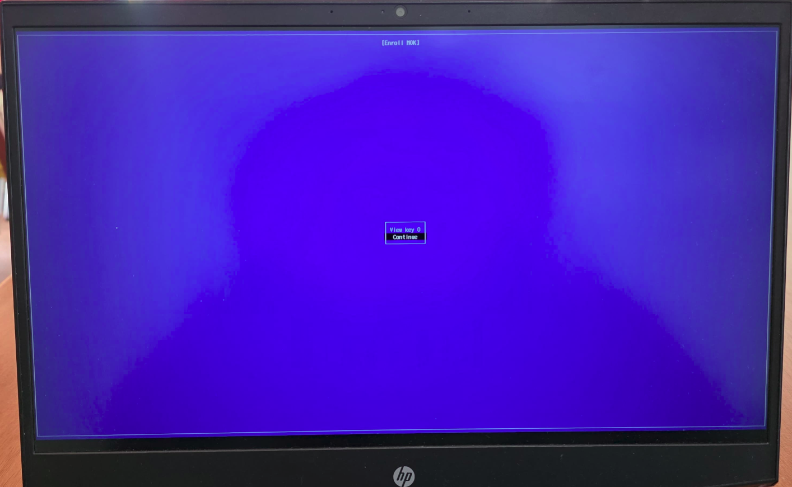
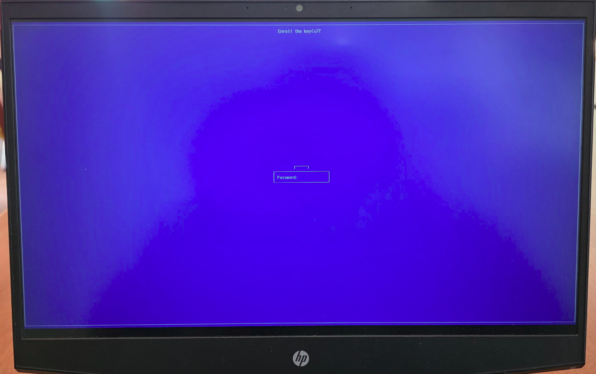
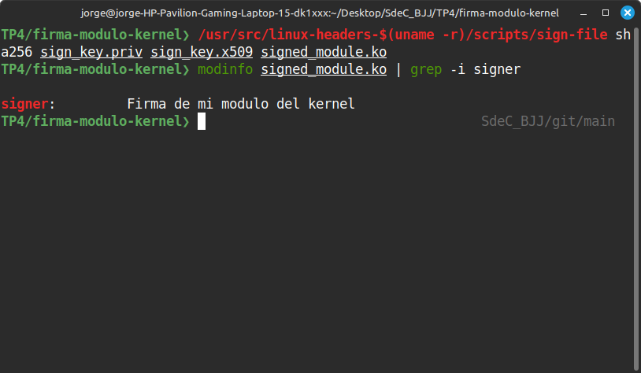

# Trabajo Práctico N°4: 
## MÓDULOS DE KERNEL Y LLAMADAS A SISTEMA

**Nombres**  
_Jorge A. Arbach_; _Bianca A. Fraga_; _José I. López Sivilat_

**Grupo**: BJJ  
**Universidad Nacional de Córdoba**  
**Sistemas de Computación**

**Fecha**: 19/05/2025

---

### Información de los autores

- **Información de contacto**:  
  _jorge.arbach@mi.unc.edu.ar_;  
  _bianca.fraga@mi.unc.edu.ar_;  
  _jose.lopez.sivilat@mi.unc.edu.ar_.

---

# Introducción

El lenguaje C es poderoso, flexible y esencial en el desarrollo de sistemas operativos. A medida que profundizamos en su aplicación, nos encontramos con la necesidad de interactuar directamente con el núcleo de Linux, el corazón del sistema operativo. Aquí es donde entran en juego los módulos del núcleo: piezas clave que permiten extender sus capacidades sin necesidad de reconstruir y reiniciar el sistema.

En este informe exploraremos qué son los módulos del núcleo, cómo funcionan y por qué son fundamentales en la arquitectura del kernel. Desde los controladores de dispositivos hasta las extensiones de funcionalidad, estos módulos nos permiten adaptar el sistema a nuestras necesidades de manera eficiente y dinámica. Pero con gran poder viene gran responsabilidad: un solo error puede comprometer la estabilidad del sistema. Por eso, comprender su diseño y funcionamiento es esencial para cualquier desarrollador que busque optimizar y expandir el alcance del kernel de Linux.

---

# Desarrollo

Para el desarrollo y compilación de módulos del núcleo en Linux, es imprescindible contar con un sistema operativo Linux instalado junto con sus fuentes o, al menos, los headers correspondientes. La descarga de estos archivos puede tomar algunos minutos, dependiendo del ancho de banda disponible en la conexión a internet.

En esta primera etapa, trabajaremos con los programas fuente y archivos de configuración (`Makefiles`) necesarios. Para ello, debemos realizar un **fork** del repositorio disponible, seguido de la clonación de nuestra copia del repositorio. Posteriormente, instalaremos las dependencias requeridas para la compilación. A continuación, se detallan los comandos utilizados:

```bash
fork https://gitlab.com/sistemas-de-computacion-unc/kenel-modules.git 
git clone (su propia url… empieza con SU nombre de usuario)
sudo apt-get install build-essential checkinstall kernel-package linux-source
```
Tras ejecutar estos comandos, el sistema descargará y configurará las herramientas necesarias para el desarrollo de módulos del núcleo. 

Este proceso nos proporciona el entorno adecuado para comenzar la implementación del módulo correspondiente dentro de la carpeta `tp4`, asegurando que contamos con todas las herramientas necesarias para su desarrollo y prueba.

## Desafío 1

### _¿Qué es checkinstall y para qué sirve?_

**Checkinstall** es un programa para sistemas operativos tipo _Unix_ que facilita la instalación y desinstalación de software compilado desde el código fuente. Permite que el software instalado desde el código fuente sea gestionado por un sistema de gestión de paquetes, como `apt` o `yum`, haciendo que sea más fácil actualizar o eliminar el software en el futuro. 
En esencia, **Checkinstall** actúa como un puente entre el proceso de compilación de software desde el código fuente y los sistemas de gestión de paquetes. En lugar de simplemente copiar los archivos a su ubicación final, Checkinstall crea un paquete (como un archivo `.deb` o `.rpm`) que luego puede ser instalado y gestionado por el sistema de gestión de paquetes. 

Sus utilidades son:

**1. Facilita la desinstalación:** Permite eliminar el software de manera limpia usando el gestor de paquetes del sistema.

**2. Genera paquetes compartibles:** Se pueden instalar en varias computadoras sin necesidad de recompilar el código.

**3. Mantiene el sistema organizado:** Evita conflictos entre archivos del sistema y software instalado manualmente.

**4. Simplifica actualizaciones:** Permite actualizar el software sin perder el control sobre los archivos instalados.

### _Uso de CheckInstall para la instalación de paquetes_

Para instalar un programa compilado desde código fuente de manera organizada y reversible, seguimos los siguientes pasos con **CheckInstall**:

**1. Compilación del programa:** ejecutamos los comandos habituales para compilar el código fuente:

```bash
./configure
make
```
**2. Instalación con Chekinstall:** en lugar de `make install`, utilizamos:

```bash
sudo chekinstall
```

**3. Creación de documentación:** `checkInstall` nos preguntará si queremos crear un directorio para almacenar documentación relevante para el paquete. Aceptamos ingresando `y` (Sí) y continuamos.

**4. Descripción del paquete:** luego, se nos solicitará ingresar una descripción breve del paquete, la cual aparecerá en el campo **Resumen** cuando se consulte la información del paquete.

**5. Confirmación de detalles y configuración de dependencias:** en la última pantalla, CheckInstall mostrará un resumen con todos los detalles del paquete antes de su creación. Aquí, podemos establecer **dependencias**, es decir, otros paquetes que el software necesita para funcionar correctamente.
Para definir dependencias, se pueden agregar manualmente en el campo correspondiente o utilizar la opción  --requires` en la línea de comandos. Por ejemplo:

```bash
sudo chekinstall --requires="libc6, libncurses5"
```
Esto asegura que el paquete generado indique que necesita `libc6` y `libncurses5` para su correcto funcionamiento.

Una vez completado el proceso, el paquete estará listo para ser instalado y administrado con el gestor de paquetes del sistema.

### _Uso de checkinstall para empaquetar un hello world_

Este informe describe el proceso de empaquetado de un programa simple en C, utilizando `checkinstall` para generar un paquete `.deb`. El objetivo es instalar el programa de manera organizada, permitiendo su fácil administración y desinstalación.

En primer lugar, se creó un archivo llamado `helloWorld.c` con un programa básico que imprime un mensaje en la consola:


Luego, para automatizar la compilación e instalación, se creó un `Makefile` con las siguientes reglas:


Este archivo permite compilar (`make`), instalar (`make install`) y limpiar (`make clean`) el programa. 

Para empaquetar el programa **Hello World** utilizando `checkinstall`, primero se compila el código fuente con `make`, lo que genera el ejecutable `helloWorld`. Luego, en lugar de instalarlo manualmente, se usa `checkinstall`, que crea un paquete `.deb` compatible con sistemas **Debian/Ubuntu**. Durante el proceso, se solicita una descripción del paquete y se generan archivos importantes, como `description-pak`, que contiene información del programa, y el `.deb`, que facilita su instalación y gestión.

Una vez generado el paquete, se instala con `dpkg -i`, permitiendo que el programa pueda ejecutarse desde cualquier ubicación en la terminal. Si en algún momento es necesario desinstalarlo, `dpkg -r` elimina el paquete sin dejar archivos residuales en el sistema. A continuación, se muestran las figuras comprobando lo que se explicó anteriormente: 


El uso de `checkinstall` para empaquetar software ofrece múltiples beneficios en términos de administración y distribución del programa. Algunas de las principales ventajas incluyen:

* **Facilidad de desinstalación:** Gracias a la integración con el sistema de gestión de paquetes (como `apt`, `yum`, o `dnf`), el software puede ser eliminado de manera ordenada sin dejar archivos residuales.

* **Portabilidad del paquete:** Al generar un archivo `.deb` o `.rpm`, el programa puede instalarse en otros sistemas con la misma arquitectura y distribución sin necesidad de recompilación.

* **Registro de archivos instalados:** Se almacena un listado detallado de los archivos agregados y sus ubicaciones en el sistema, lo que facilita auditorías y mantenimiento posterior.

Además, para fortalecer la seguridad en sistemas que utilizan **módulos del kernel**, se pueden adoptar varias medidas con el fin de evitar la carga de módulos no firmados. Algunas estrategias recomendadas incluyen:

* **Uso de SELinux/AppArmor:** Implementar estas herramientas permite aplicar políticas de control de acceso que restringen las operaciones de los procesos y módulos del kernel.

* **Auditoría y monitoreo del sistema:** Herramientas como `auditd` registran eventos críticos, permitiendo identificar posibles amenazas o actividades sospechosas relacionadas con la carga de módulos.

* **Control de integridad:** Mediante tecnologías como _IMA/EVM_ (Integrity Measurement Architecture / Extended Verification Module), se verifica la autenticidad de archivos y binarios del sistema, evitando modificaciones no autorizadas.

* **Mantenimiento del kernel y módulos actualizados:** Aplicar actualizaciones periódicas con herramientas como `apt`, `dnf` o `yum` ayuda a mitigar vulnerabilidades conocidas.

* **Uso de módulos firmados por la distribución:** Optar por módulos oficiales verificados por proveedores como _Red Hat_ o _Ubuntu_ reduce riesgos al garantizar que han sido validados por los desarrolladores.

* **Restricción de carga de módulos específicos:** Modificar el archivo `/etc/modprobe.d/` permite establecer políticas estrictas sobre qué módulos pueden cargarse, evitando la ejecución de componentes no confiables.

Implementar estas buenas prácticas no solo mejora la gestión de software empaquetado con `checkinstall`, sino que también contribuye a reforzar la seguridad del sistema, protegiendo el entorno de posibles amenazas o modificaciones indebidas.

## Desafío 2

### _¿Qué funciones tiene disponible un programa y un módulo?_

En términos generales, un **programa** y un **módulo** tienen funciones distintas dependiendo de su propósito dentro del sistema. Las diferencias que se presentan entre ambos son las siguientes:

* **PROGRAMA:** Un programa es una aplicación ejecutable que interactúa con el usuario y realiza tareas específicas. Sus funciones pueden incluir:

1. Ejecutar operaciones de usuario (por ejemplo, leer y escribir archivos, procesar datos).

2. Interactuar con el sistema operativo usando llamadas a funciones del sistema.

3. Gestionar memoria y procesos dentro de su ejecución.

4. Mostrar salida en la terminal o en una interfaz gráfica.

_Ejemplo:_ Un editor de texto como `nano` es un programa que permite modificar archivos.

* **MÓDULO:** Un módulo del kernel es un componente del sistema operativo que extiende sus funcionalidades sin necesidad de recompilar el kernel. Sus funciones pueden ser:

1. Proporcionar controladores de hardware (como módulos para manejar periféricos USB, gráficos, red, etc.).

2. Extender las capacidades del kernel (por ejemplo, agregar compatibilidad con sistemas de archivos).

3. Optimizar la gestión de recursos del sistema sin afectar el núcleo central del sistema.

_Ejemplo:_ El módulo `e1000` es un controlador de red para ciertos adaptadores Ethernet.

### _Espacio de usuario o espacio del kernel_

El **espacio de usuario** y el **espacio del kernel** son dos áreas diferenciadas en el sistema operativo que gestionan la ejecución de procesos y la interacción con el hardware:

* **ESPACIO DE USUARIO:** Es donde se ejecutan los programas y procesos que no forman parte del núcleo del sistema. Sus características incluyen:

**1. Acceso restringido al hardware:** Los procesos no pueden acceder directamente a la memoria o dispositivos sin pasar por el kernel.

**2. Ejecución de aplicaciones:** Programas como editores de texto, navegadores y terminales funcionan en este espacio.

**3. Mayor seguridad y estabilidad:** Al estar aislados del kernel, errores en programas de usuario no afectan la estabilidad del sistema.

_Ejemplo:_ Un proceso como `nano` o `firefox` se ejecuta en el espacio de usuario.

* **ESPACIO DEL KERNEL:** Es el área del sistema donde el kernel opera y controla los recursos del hardware. Sus características son:

**1. Acceso directo al hardware:** El kernel maneja memoria, dispositivos y procesos sin restricciones.

**2. Gestión del sistema:** Controla el uso de la CPU, la planificación de procesos y la administración de memoria.

**3. Ejecuta módulos del kernel:** Drivers y extensiones del sistema operan en este espacio para interactuar con hardware específico.

_Ejemplo:_ Un módulo del kernel como `ext4.ko` gestiona el sistema de archivos `EXT4` en Linux.

### _Espacio de datos_

El **espacio de datos** se refiere al área de memoria donde un programa o el kernel almacenan y manipulan información. Dependiendo de si hablamos del espacio de usuario o espacio del kernel, los datos se gestionan de manera distinta:

**ESPACIO DE DATOS EN EL ESPACIO DE USUARIO:** 

1. Contiene variables y estructuras de datos usadas por programas que se ejecutan en el sistema.

2. Se gestiona mediante la memoria virtual, lo que impide que los programas accedan directamente al hardware.

3. Permite la separación de procesos, garantizando que cada aplicación tenga su propio espacio aislado.

_Ejemplo:_ Cuando un programa de usuario como `firefox` carga una página web, almacena los datos en su espacio de usuario.

**ESPACIO DE DATOS EN EL ESPACIO DEL KERNEL:** 

1. Contiene estructuras críticas como la tabla de procesos, buffers de entrada/salida y configuraciones del sistema.

2. Puede acceder directamente a la memoria física, sin restricciones de protección de procesos.

3. Se utiliza para almacenar información sobre módulos del kernel, dispositivos y administración de recursos.

_Ejemplo:_ Cuando el kernel maneja memoria RAM, gestiona las páginas en el espacio de datos del kernel, optimizando la administración de recursos.

### _Drivers_

Un **driver** es un software que actúa como puente entre el sistema operativo y un dispositivo físico. Su función es traducir las instrucciones de alto nivel del sistema en comandos específicos para el hardware. Sin los drivers, el sistema operativo no podría interactuar con los componentes físicos de la computadora.

En Linux, los drivers generalmente se implementan como módulos del kernel, los cuales pueden cargarse y descargarse en tiempo de ejecución para ampliar las funcionalidades del sistema sin necesidad de recompilar el kernel.

_Ejemplo de drivers comunes en Linux:_

* **Drivers de red (`e1000`, `rtl8139`):** Controlan tarjetas de red y permiten la conexión a internet.

* **Drivers de almacenamiento (`nvme`, `sda`):** Gestionan discos duros, SSDs y memorias USB.

* **Drivers gráficos (`i915`, `nvidia`):** Controlan tarjetas gráficas para renderizado de pantalla.

_Tipos de dispositivos en `/dev`_

Dentro de `/dev`, los dispositivos se dividen en dos grandes categorías:

**1. Dispositivos de bloque (b):** Almacenan información en bloques y permiten operaciones como lectura y escritura en discos duros y particiones. 
Ejemplo: `/dev/sda` (primer disco duro), `/dev/mmcblk0` (tarjeta SD).

**2. Dispositivos de carácter (c):** Procesan datos byte a byte y se utilizan para teclados, ratones y puertos serie. 
Ejemplo: `/dev/ttyS0` (puerto serie), `/dev/input/event0` (entrada del teclado).

_Otros archivos relevantes:_

* `/dev/null`: Dispositivo especial que descarta cualquier dato que se le envíe.

* `/dev/random` y `/dev/urandom`: Generadores de números aleatorios.

* `/dev/fb0`: Representa el framebuffer de la pantalla.

Cuando se carga un módulo del kernel que contiene un driver, este puede generar un nuevo archivo dentro de `/dev`, permitiendo a los programas acceder al hardware a través de ese archivo. Por ejemplo, al conectar una unidad USB, el sistema la detecta y crea un archivo como `/dev/sdb`.

Para explorar los dispositivos disponibles, se puede ejecutar:

```bash
ls -l /dev
```
Y para verificar los módulos del kernel activos:

```bash
lsmod
```
## Experiencia práctica

En primer lugar ejecutamos el comando `make` en la carpeta correspondiente:


En sistemas Linux, el kernel puede extender sus funcionalidades mediante módulos que se cargan en tiempo de ejecución según las necesidades del sistema. Un módulo del kernel es una pieza de código que actúa como una extensión, proporcionando compatibilidad con hardware específico, sistemas de archivos adicionales, funciones de seguridad o características personalizadas sin requerir la recompilación completa del kernel.

Para insertar un módulo en el kernel, se utiliza la herramienta `insmod`, un comando que carga el archivo de módulo (`mimodulo.ko`) en la estructura del kernel. La ejecución de este comando **instruye al sistema a integrar el módulo `mimodulo.ko` en el kernel**, lo que le permite realizar funciones específicas dentro del sistema operativo. Este proceso es fundamental cuando se requieren nuevos controladores de hardware o mejoras en las funcionalidades del núcleo sin necesidad de reiniciar el sistema. 
Dado que la manipulación del kernel puede afectar el funcionamiento del sistema, es imprescindible contar con privilegios de superusuario al ejecutar `insmod`, lo que se logra mediante `sudo`. Sin estos permisos, el sistema impide la carga de módulos por seguridad, evitando que usuarios sin autorización realicen modificaciones críticas en el núcleo del sistema.


Luego, al ejecutar el comando `sudo dmesg`, se obtiene lo siguiente (Se puede observar una gran cantidad de codigo,pero se adjunta una parte de él):


El comando `dmesg` en Linux permite visualizar los mensajes generados por el kernel, ofreciendo información clave sobre el funcionamiento del sistema, el hardware conectado y posibles errores. Su uso es esencial para la depuración, especialmente en el arranque y en eventos como conexiones o desconexiones de dispositivos.

Dentro de los registros de `dmesg`, algunos mensajes destacan por su relevancia:

* `mimodulo: module verification failed`: Este aviso indica que el módulo `mimodulo.ko` no pudo ser verificado debido a la falta de firma o clave requerida. Esto ocurre cuando el módulo no coincide con la firma usada por el kernel. Para solucionarlo, se puede firmar utilizando la herramienta `sign-file` del árbol de código fuente del kernel junto con una clave privada (`CONFIG_MODULE_SIG_KEY`). Si no se define una clave personalizada, el sistema usará `certs/signing_key.pem`.

* `[UFW BLOCK]`: Este mensaje proviene del firewall _UFW (Uncomplicated Firewall)_ y señala que ciertos paquetes de red han sido bloqueados. La información incluye detalles como la interfaz de red utilizada (`IN=wlp3s0`), direcciones MAC y IP de origen y destino, y la longitud del paquete bloqueado. Este tipo de registros son útiles para analizar intentos de conexión y posibles amenazas.

Además, se identificaron eventos relacionados con la conectividad y el estado del sistema:

* `wlp3s0: deauthenticating by local choice`: Indica que el dispositivo de red inalámbrica (`wlp3s0`) se ha desconectado voluntariamente de la red.

* `PM: suspend entry (deep)`: Señala que el sistema ha entrado en suspensión profunda (S3 o suspensión a RAM).

* `Filesystems sync: 0.025 seconds`: Confirma que los sistemas de archivos han sido sincronizados antes de la suspensión para evitar pérdida de datos.

* `Freezing user space processes`: Indica que los procesos del espacio de usuario han sido "congelados" temporalmente como parte del proceso de suspensión.

* `OOM killer disabled`: Muestra que el sistema ha desactivado el mecanismo "OOM Killer", que normalmente elimina procesos cuando la memoria es insuficiente.

`printk: Suspending console(s)`: Notifica que las consolas del sistema han sido suspendidas. Se puede evitar esto usando `no_console_suspend` para depuración.

En sistemas Linux, los módulos del kernel permiten extender las funcionalidades del sistema sin necesidad de recompilar el núcleo. Para verificar qué módulos están activos, se utilizan herramientas como `lsmod` y `cat /proc/modules`, que muestran información relevante sobre los módulos cargados.

Ejecutando el comando `lsmod | grep mod`, se obtiene una salida como:


Aquí, la información proporcionada indica:

* `mimodulo`: Nombre del módulo cargado en el kernel.

* `12288`: Tamaño del módulo en bytes.

* `0`: Cantidad de dependencias; en este caso, ningún otro módulo depende de `mimodulo`.

El comando `lsmod` lista los módulos actualmente en ejecución, mientras que `grep mod` filtra la salida para mostrar solo los módulos que contienen la cadena `"mod"` en su nombre.

Para obtener más detalles sobre los módulos cargados, se ejecuta el siguiente comando generando una salida similar a: 


Cada campo en la salida tiene un significado específico:

* `mimodulo`: Nombre del módulo cargado.

* `12288`: Tamaño del módulo en bytes.

* `0`: Número de instancias activas (0 significa que está cargado pero no en uso).

* `Live`: Indica que el módulo está activo en el sistema.

* `0x0000000000000000`: Dirección de memoria donde está ubicado el módulo.

* `(OE)`: Banderas del módulo:

`O`: Indica que es un módulo oficial del kernel.

`E`: Señala que el módulo está en un estado de error.

Para gestionar los módulos del kernel en Linux, se pueden cargar, inspeccionar y eliminar según sea necesario. En este caso, se utilizó el comando `rmmod` para eliminar un módulo previamente cargado.


Este comando instruye al sistema para descargar el módulo del kernel, eliminando sus funciones y liberando la memoria que ocupaba. Como los módulos afectan directamente al sistema, el uso de `sudo` es esencial para tener permisos administrativos en la operación.

Después de ejecutar `rmmod`, se comprobaron los módulos activos con:


Ambos comandos no devolvieron resultados, lo que confirma que `mimodulo` ya no está presente en el sistema.

Aunque `mimodulo` ha sido eliminado, aún es posible consultar sus detalles en el archivo `.ko` con:


Cada campo de salida significa:

* `filename`: el nombre del archivo del módulo del kernel.
* `author`: el autor del módulo del kernel.
* `description`: Esta es una breve descripción del módulo del kernel.
* `license`: Esta es la licencia bajo la cual se distribuye el módulo del kernel.
* `srcversion`: la versión del código fuente del módulo del kernel.
* `depends`: Esta es una lista de otros módulos del kernel de los que dependen de este módulo.
* `retpoline`: Este campo indica si el módulo del kernel está compilado con protecciones Retpoline para mitigar la vulnerabilidad de ejecución especulativa del procesador.
* `name`: el nombre del módulo del kernel.
* `vermagic`: cadena que contiene la versión del kernel, el tipo de CPU, el estado de SMP (Symmetric MultiProcessing), y otras opciones que deben coincidir exactamente con el kernel en ejecución para que el módulo pueda ser cargado.

Luego, al ejecutar el comando `modinfo /lib/modules/$(uname -r)/kernel/crypto/des_generic.ko`
se obtiene:


El comando `modinfo` permite obtener información detallada sobre un módulo del kernel antes de su carga, mostrando atributos clave como su licencia, dependencias y seguridad.

Cada campo de la salida quiere decir: 

* `filename`: el nombre del archivo del módulo del kernel.
* `alias`: los alias del módulo del kernel. Los alias son nombres alternativos que se pueden usar para referirse al módulo.
* `author`: Este es el autor del módulo del kernel.
* `description`: Esta es una breve descripción del módulo del kernel. 
* `license`: Esta es la licencia bajo la cual se distribuye el módulo del kernel.
* `srcversion`: Esta es la versión del código fuente del módulo del kernel.
* `depends`: Esta es una lista de otros módulos del kernel de los que dependen de este módulo.
* `retpoline`: Este campo indica si el módulo del kernel está compilado con protecciones Retpoline para mitigar la vulnerabilidad de ejecución especulativa del procesador.
* `intree`: Este campo indica si el módulo del kernel está incluido en el árbol de código fuente del kernel. 
* `name`: Este es el nombre del módulo del kernel.
* `vermagic`: Esta es una cadena que contiene la versión del kernel, el tipo de CPU, el estado de SMP (Symmetric MultiProcessing), y otras opciones que deben coincidir exactamente con el kernel en ejecución para que el módulo pueda ser cargado.
* `sig_id`: Este campo indica el tipo de firma digital utilizada para firmar el módulo del kernel.
* `signer`: Este campo indica la entidad que registró el módulo del kernel.
* `sig_key`: Esta es la clave pública utilizada para verificar la firma digital del módulo del kernel.
* `sig_hashalgo`: Este campo indica el algoritmo de hash utilizado para generar la firma digital del módulo del kernel.
* `signature`: Esta es la firma digital del módulo del kernel.

Estos datos permiten verificar la autenticidad, compatibilidad y requerimientos de un módulo antes de su ejecución. Además, facilitan la identificación de dependencias y posibles problemas de seguridad, como la falta de firmas válidas

### _¿Qué diferencias se pueden observar entre los dos modinfo?_

El comando `modinfo` permite obtener información detallada sobre los módulos del kernel, mostrando atributos clave como la licencia, el autor, las dependencias y detalles de seguridad. Al ejecutarlo sobre dos módulos distintos, `mimodulo.ko` y `des_generic.ko`, se identifican diferencias notables entre ambos.

Una de las principales diferencias radica en la naturaleza de cada módulo. Mientras que `mimodulo.ko` es un módulo personalizado, desarrollado e insertado manualmente en el sistema, `des_generic.ko` es un módulo estándar incluido en el árbol de código fuente del kernel y almacenado en la ruta `/lib/modules/$(uname -r)/kernel/crypto/`. Esto significa que `des_generic.ko` forma parte de las funcionalidades predefinidas del sistema, mientras que `mimodulo.ko` se incorporó de manera independiente.

Además, la información proporcionada por `modinfo` es diferente para cada módulo debido a sus distintas propiedades. En `mimodulo.ko`, el autor, la descripción, la versión del código fuente y la firma digital son propias del módulo desarrollado, mientras que `des_generic.ko` cuenta con especificaciones establecidas por la distribución del kernel. Otra diferencia significativa es la presencia de dependencias: `mimodulo.ko` no depende de otros módulos, mientras que `des_generic.ko` requiere `libdes` para su correcto funcionamiento dentro del sistema.

Otro aspecto diferenciador es la asignación de alias dentro del kernel. `mimodulo.ko` no posee alias registrados, mientras que `des_generic.ko` cuenta con varios alias, lo que facilita su identificación bajo distintos nombres. Asimismo, en términos de seguridad, `des_generic.ko` tiene una firma digital validada, mientras que `mimodulo.ko` no cuenta con una firma certificada, lo que puede generar advertencias al intentar cargarlo en el kernel.

En resumen, la ejecución de `modinfo` sobre distintos módulos del kernel permite analizar sus diferencias en origen, estructura, dependencias y seguridad. Mientras que un módulo personalizado como `mimodulo.ko` requiere gestión manual y no cuenta con validaciones propias del kernel, un módulo estándar como `des_generic.ko` está optimizado para su integración dentro del sistema y proporciona mayores garantías de seguridad y compatibilidad.

### _¿Qué controladores/módulos están cargados en su propia PC?_

Para analizar las diferencias en los módulos del kernel cargados en distintos sistemas, se utilizó el comando `lsmod`, el cual muestra todos los módulos activos en un momento determinado. Los resultados fueron almacenados en archivos de texto dentro de la carpeta `ModulosIntegrantes`, permitiendo comparar las salidas de distintos usuarios.

Para realizar esta comparación, se ejecutaron los siguientes comandos en la terminal:


Estos comandos generan archivos de diferencias, en los cuales:

* Las líneas que comienzan con `<` representan módulos que están en el primer archivo pero no en el segundo.

* Las líneas que comienzan con `>` corresponden a módulos presentes en el segundo archivo pero ausentes en el primero.

El análisis de los módulos del kernel mediante herramientas como `lsmod` y `diff` permite identificar variaciones en la configuración de los sistemas Linux. Estas diferencias pueden deberse a múltiples factores, como el hardware instalado, las necesidades de los usuarios, las configuraciones de software y las distribuciones específicas utilizadas.

Cada sistema carga un conjunto particular de módulos que proporcionan soporte para dispositivos, comunicación en red, administración de energía y compatibilidad con distintos tipos de hardware. Algunos módulos son comunes entre diferentes equipos, lo que sugiere una base estándar en las configuraciones del kernel, mientras que otros varían, reflejando personalizaciones o requerimientos específicos de cada entorno.

La comparación de estas configuraciones es útil para detectar módulos innecesarios, optimizar el rendimiento del sistema y garantizar la seguridad del kernel. Además, permite comprender cómo las distintas distribuciones o versiones del sistema operativo gestionan los controladores y extensiones del kernel, facilitando el mantenimiento y la personalización de la infraestructura tecnológica.

### _¿Cuáles no están cargados pero están disponibles? ¿Qué pasa cuando el controlador de un dispositivo no está disponible?_

Para analizar los módulos disponibles y cargados en el sistema Linux, se pueden utilizar herramientas como `lsmod` y `ls -R /lib/modules/$(uname -r)`, que permiten inspeccionar el estado del kernel y sus componentes.

* **Listado de módulos disponibles:** Este comando muestra todos los módulos que están instalados en el sistema, es decir, aquellos que pueden ser cargados si se necesitan.


* **Listado de módulos actualmente cargados:** Este comando muestra los módulos activos, es decir, los que están en uso en el kernel.


Para facilitar la identificación de los módulos que están disponibles pero no cargados, se desarrolló un script en Bash llamado `scriptPreguntaCargNoDisp.sh`. Este script compara los módulos instalados en el sistema con aquellos realmente en uso, permitiendo detectar cuáles están presentes pero no han sido activados en el kernel.

La ejecución de este script genera una lista extensa de módulos disponibles pero no cargados, lo que puede ser útil para evaluar posibles controladores faltantes o módulos que podrían optimizar el funcionamiento del sistema.

Cuando un módulo del kernel no está cargado, el sistema podría experimentar inconvenientes relacionados con el hardware. Algunas de las posibles consecuencias incluyen:

**1. Dispositivos no reconocidos:** Si un controlador específico no está activo, ciertos periféricos como tarjetas de red, discos o teclados pueden no funcionar correctamente.

**2. Reducción del rendimiento:** Algunos módulos optimizan la comunicación con el hardware; si no están cargados, la eficiencia del sistema puede verse afectada.

**3. Fallos en la conectividad:** La ausencia de controladores de red podría impedir conexiones WiFi, Ethernet o Bluetooth.

**4. Errores en el sistema de archivos:** La falta de módulos de compatibilidad puede hacer que ciertos sistemas de archivos no sean accesibles.

### _hwinfo_

La herramienta `hwinfo` permite obtener un análisis detallado de los componentes físicos de un sistema. Su ejecución proporciona una visión completa del hardware disponible, facilitando tareas como diagnóstico, soporte técnico y optimización del rendimiento del sistema.

Para utilizar `hwinfo`, primero se instala con el siguiente comando:


Como la salida generada es extensa, se almacena en un archivo de texto para su revisión detallada:


Este archivo contiene información sobre los diferentes componentes del sistema, incluyendo CPU, RAM, tarjetas gráficas, almacenamiento, periféricos y controladores USB. Para cumplir con la consigna, el archivo generado se ha subido a un almacenamiento en la nube, permitiendo su acceso según lo solicitado en el reporte: [hwinfo](https://drive.google.com/file/d/1OBzrPYPXUlJL9cEUzYK0t1ce7yK7K8Jv/view)

Además de su uso básico, `hwinfo` ofrece opciones para filtrar la información y generar reportes en distintos formatos, como texto, CSV o XML, lo que facilita su integración con herramientas de análisis y monitoreo de hardware.

Como conclusión, la herramienta `hwinfo` es fundamental para obtener detalles del hardware en sistemas Linux, proporcionando información precisa y organizada sobre todos los dispositivos conectados. Su capacidad de generar reportes facilita la administración y mantenimiento de equipos, siendo una herramienta esencial para técnicos y administradores de sistemas.

### _¿Qué diferencia existe entre un módulo y un programa?_

Las diferencias que podemos notar son las siguiente:

**1. Función:** Un programa es una aplicación que se ejecuta en el sistema operativo para realizar una tarea específica, como procesar texto o navegar por la web. Por otro lado, un módulo es un componente de software que realiza una función específica dentro de un sistema mayor. Por ejemplo, un driver es un tipo de módulo que permite que el sistema operativo se comunique con un dispositivo de hardware.
**2. Interacción con el sistema operativo:** Los programas invocan funciones específicas del sistema operativo para realizar sus tareas. En cambio, los módulos, como los drivers, son invocados por el sistema operativo para interactuar con el hardware.
**3. Ubicación en el sistema:** Los programas suelen estar almacenados en el disco duro y se cargan en la memoria cuando se ejecutan. Los módulos, por otro lado, pueden ser cargados y descargados dinámicamente en el sistema, de manera que solo están activos en memoria cuando se les necesita. 
**4. Reutilización de código:** En la programación modular, los módulos permiten reutilizar código y compartir funciones entre programas. En cambio, aunque un programa puede contener funciones reutilizables, es una entidad independiente que se ejecuta para realizar una tarea específica.

### _¿Cómo puede ver una lista de las llamadas al sistema que realiza un simple helloworld en c?_

Para examinar las llamadas al sistema realizadas por un programa en Linux, se utilizó la herramienta `strace`, que permite rastrear la interacción del código con el kernel.

El proceso comenzó con la creación del archivo fuente `HelloWorld.c`, que contiene una instrucción simple en C para imprimir `"hello world"` en pantalla. Luego, el programa se compiló con el siguiente comando:


Este comando genera el ejecutable `hello`, que posteriormente se ejecutó utilizando `strace`:


La salida obtenida muestra una serie de llamadas al sistema realizadas por el programa durante su ejecución:


En este archivo, cada línea corresponde a una llamada al sistema realizada por el programa. Entre estas llamadas, se destacan aquellas que gestionan la entrada y salida de datos, la asignación de memoria y la interacción con archivos.

Al analizar el contenido, se observa que en una de las últimas líneas se encuentra la siguiente instrucción:


Este registro refleja la llamada al sistema `write()`, que se encarga de escribir en la salida estándar (**descriptor de archivo** `1`, que representa la terminal). La ejecución de esta instrucción corresponde a la acción del `printf("hello world")` en el código C original, demostrando cómo una función de alto nivel en C se traduce en una operación interna del sistema.

### _¿Qué es un segmentation fault? ¿Cómo lo maneja el kernel y cómo lo hace un programa?_

Una violación de segmentación **(segmentation fault)** ocurre cuando un programa intenta acceder a una dirección de memoria no permitida por el sistema operativo. Esto sucede cuando el acceso se realiza fuera de los límites asignados, generando un error crítico que interrumpe la ejecución del programa.

Entre las causas más comunes de este problema se encuentran:

* Uso incorrecto de los operadores `&` (dirección) y `*` (indirección).

* Errores en cadenas de formato en funciones como `printf` y `scanf`.

* Olvidar utilizar `&` en los argumentos de `scanf`.

* Intentar acceder más allá de los límites de una matriz o vector.

* No inicializar un puntero antes de utilizarlo.

* Acceder de manera incorrecta a un área de memoria válida para el programa.

* Referenciar un objeto o variable que ha sido eliminado de la memoria.

Cuando ocurre un `segmentation fault`, el sistema operativo recibe una interrupción de hardware. El kernel analiza la causa del error y determina si puede manejarlo o simplemente notificarlo a la aplicación. En situaciones como la referencia a punteros nulos, el kernel solo puede informar que ha ocurrido un problema, deteniendo el programa afectado.

Desde la _perspectiva del programa_, un `segmentation fault` generalmente resulta en una interrupción inmediata de la ejecución, generando un informe de error. Para identificar la causa del fallo, los desarrolladores pueden utilizar herramientas de depuración como `gdb`, que permiten examinar el estado del programa al momento del error y detectar las líneas de código responsables.

En conclusión, las violaciones de segmentación son errores críticos que afectan la estabilidad de los programas y pueden ser causadas por accesos incorrectos a la memoria. Comprender cómo el kernel maneja estos errores y cómo los desarrolladores pueden depurarlos es clave para mejorar la estabilidad y seguridad del software.

### _Firma de módulo kernel_

Ahora se va a realizar el proceso de firma de módulos del kernel en Linux, y su posterior carga y descarga en un sistema con Secure Boot habilitado, garantizando su legitimidad mediante claves criptográficas. 

En primer lugar se diseño un módulo simple en c: [signed_module.c](https://github.com/Jorgear27/SdeC_BJJ/blob/main/TP4/firma-modulo-kernel/signed_module.c). Se eligió hacer uso de make para compilar `signed_module.c`. 

Una vez que se dispone del código del módulo del kernel, debemos proceder a firmar el mismo:

**1. Generación de claves**

Para crear las claves haremos uso de open ssl y correremos el siguiente comando:

```bash
openssl req -new -x509 -newkey rsa:2048 -keyout sign_key.priv \
    -outform DER -out sign_key.x509 -nodes -days 36500 \
    -subj "/CN=Firma de mi modulo del kernel/"
```

Esto va a crear 2 archivos:

* `sign_key.priv`: Clave privada
* `sign_key.x509`: Certificado público

**2. Configuración del sistema para usar estas claves**

Se debe copiar las claves a la carpeta de certificados del kernel para que sean reconocidas:

```bash
sudo cp sign_key.x509 /var/lib/shim-signed/mok/MOK.der
```
Luego registrámos la clave con MOK (Machine Owner Key), se solicita una contraseña temporal:
```bash
sudo mokutil --import sign_key.x509
```


Luego de registrar la clave, hay que reiniciar el sistema y seguir las instrucciones del asistente para inscribir la clave con MOK como vemos a continuación:





**3. Firma del módulo**

Al reiniciar el sistema, se firma el modulo de la siguiente manera:
```bash
/usr/src/linux-headers-$(uname -r)/scripts/sign-file sha256 sign_key.priv sign_key.x509 signed_module.ko
```

Y se puede verificar dicha firma corriendo lo siguiente:

```bash
modinfo signed_module.ko | grep signer
```




**4. Carga y descarga del módulo**

Para corroborar y poder realizar la experiencia de manera correcta, primero comprobamos el estado de Secure Boot:

```bash
mokutil --sb-state
```

Al corroborar que Secure Boot está activado, insertamos el módulo:

```bash
sudo insmod signed_module.ko
```

Podemos verificar su inserción en los logs:
```bash
dmesg | tail
```


Como podemos apreciar en la imagen, vemos que el módulo ha sido insertado correctamente.


Una vez cargado, procedemos a descargar dicho módulo:

```bash
sudo rmmod signed_module
dmesg | tail
```


Y vemos que la descarga del modulo del kernel se efectúa con éxito:


### _¿Que pasa si mi compañero con secure boot habilitado intenta cargar un módulo firmado por mi?_

Cuando una computadora intente cargar un módulo firmado por otra computadora, el sistema rechazará dicho módulo

Esto sucede, porque el módulo está firmado con una clave en nuestro sistema UEFI y el sistema UEFI del compañero no reconoce ni confía en dicha clave. Secure Boot solo permite cargar:

1. Módulos **firmados por el proveedor del kernel** (por ejemplo, Canonical en Ubuntu, Red Hat, etc.)
2. Módulos **firmados por claves que estén registradas en el firmware UEFI o el MOK (Machine Owner Key)**

De esta manera cuando el compañero intente:

```bash
sudo insmod signed_module.ko
```

va a obtener:

```
insmod: ERROR: could not insert module signed_module.ko: Key was rejected by service
```

### _Problema con dual-boot luego de actualización de Microsoft_
1. **¿Cuál fue la consecuencia principal del parche de Microsoft sobre GRUB en sistemas con arranque dual (Linux y Windows)?**

El parche de Microsoft, modificó los certificados válidos en el sector de arranque UEFI para reforzar la seguridad del Secure Boot. Sin embargo, esta actualización provocó que versiones antiguas de **GRUB** (específicamente aquellas con certificados vencidos o sin soporte para **SBAT** (*Secure Boot Advanced Targeting*)) no pudieran iniciar correctamente en sistemas con arranque dual (Linux y Windows).  

Como consecuencia los usuarios recibieron el error "Security Policy Violation" al intentar arrancar Linux, ya que el **`shim`** (componente intermedio entre el firmware UEFI y GRUB) no superó la verificación de seguridad. Distribuciones como Ubuntu (y otras basadas en versiones anteriores de GRUB) quedaron inaccesibles en sistemas con Secure Boot activado.  

2. **¿Qué implicancia tiene desactivar Secure Boot como solución al problema descrito en el artículo?**

Desactivar Secure Boot permite que los usuarios afectados por la actualización de Microsoft puedan volver a arrancar su sistema Linux, evitando el error "Security Policy Violation" causado por la verificación fallida del `shim` mediante SBAT.

Esto implica:

* Es una solución temporal y funcional para recuperar el acceso a Linux tras el fallo introducido por la actualización de Microsoft.
* El artículo menciona que dependiendo de las necesidades de seguridad del usuario, esta opción puede no ser aceptable, ya que implica renunciar a parte de la protección que ofrece Secure Boot.
* Se ofrece también una alternativa más segura que consta de desactivar Secure Boot temporalmente para eliminar la política SBAT con `mokutil`, y luego volver a activarlo.


3. **¿Cuál es el propósito principal del Secure Boot en el proceso de arranque de un sistema?**


El **Secure Boot** es un mecanismo de seguridad implementado en el firmware UEFI que garantiza que solo se ejecuten componentes de arranque firmados y verificados. 

Su función principal es evitar la carga de código malicioso, ya que bloquea cargadores de arranque, kernels o controladores que no estén firmados con certificados válidos registrados en la base de datos de claves UEFI. Además, garantiza la integridad, debido a que los sistemas operativos (como Windows o Linux) pueden exigir Secure Boot activado para cumplir con estándares de seguridad.  

---

# Conclusión

Durante este trabajo se exploraron aspectos fundamentales del desarrollo e integración de módulos en el núcleo de Linux, profundizando en la interacción entre el espacio de usuario y el espacio del kernel, así como en los mecanismos de seguridad que introduce Secure Boot.

A través del desarrollo del trabajo se comprendió:

* La diferencia entre el espacio del usuario (donde se ejecutan aplicaciones comunes) y el espacio del kernel (donde residen controladores, planificadores, y lógica de bajo nivel).
* La utilidad de herramientas como `checkinstall`, que permiten empaquetar e instalar software (como módulos) de forma controlada y reversible mediante paquetes `.deb`, en lugar de usar `make install`.
* Cómo un módulo actúa como una extensión cargable del kernel, con acceso directo al espacio de datos del kernel y funciones como `printk()` para loguear mensajes.

Además, gracias a la experiencia de firmr un modulo del kernel nos sirvio para profundiza sobre la necesidad de firmar los módulos para su aceptación por parte del kernel en sistemas con Secure Boot, así como el uso de herramientas como `sign-file` y `mokutil` para registrar claves públicas en el sistema UEFI (MOK).

Este trabajo no solo permitió abordar la parte técnica de compilar y cargar módulos, sino también aspectos de seguridad, interoperabilidad entre equipos, y los mecanismos que Linux provee para gestionar extensiones del kernel en forma segura y flexible.


# Referencias
- [1] https://askubuntu.com/questions/770205/how-to-sign-kernel-modules-with-sign-file
- [2] https://arstechnica.com/security/2024/08/a-patch-microsoft-spent-2-years-preparing-is-making-a-mess-for-some-linux-users/
