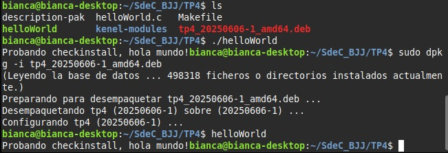

# Trabajo Práctico N°4: 
## MÓDULOS DE KERNEL Y LLAMADAS A SISTEMA

**Nombres**  
_Jorge A. Arbach_; _Bianca A. Fraga_; _José I. López Sivilat_

**Grupo**: BJJ  
**Universidad Nacional de Córdoba**  
**Sistemas de Computación**

**Fecha**: 19/05/2025

---

### Información de los autores

- **Información de contacto**:  
  _jorge.arbach@mi.unc.edu.ar_;  
  _bianca.fraga@mi.unc.edu.ar_;  
  _jose.lopez.sivilat@mi.unc.edu.ar_.

---

# Introducción

El lenguaje C es poderoso, flexible y esencial en el desarrollo de sistemas operativos. A medida que profundizamos en su aplicación, nos encontramos con la necesidad de interactuar directamente con el núcleo de Linux, el corazón del sistema operativo. Aquí es donde entran en juego los módulos del núcleo: piezas clave que permiten extender sus capacidades sin necesidad de reconstruir y reiniciar el sistema.

En este informe exploraremos qué son los módulos del núcleo, cómo funcionan y por qué son fundamentales en la arquitectura del kernel. Desde los controladores de dispositivos hasta las extensiones de funcionalidad, estos módulos nos permiten adaptar el sistema a nuestras necesidades de manera eficiente y dinámica. Pero con gran poder viene gran responsabilidad: un solo error puede comprometer la estabilidad del sistema. Por eso, comprender su diseño y funcionamiento es esencial para cualquier desarrollador que busque optimizar y expandir el alcance del kernel de Linux.

# Desarrollo

Para el desarrollo y compilación de módulos del núcleo en Linux, es imprescindible contar con un sistema operativo Linux instalado junto con sus fuentes o, al menos, los headers correspondientes. La descarga de estos archivos puede tomar algunos minutos, dependiendo del ancho de banda disponible en la conexión a internet.

En esta primera etapa, trabajaremos con los programas fuente y archivos de configuración (`Makefiles`) necesarios. Para ello, debemos realizar un **fork** del repositorio disponible, seguido de la clonación de nuestra copia del repositorio. Posteriormente, instalaremos las dependencias requeridas para la compilación. A continuación, se detallan los comandos utilizados:

```bash
fork https://gitlab.com/sistemas-de-computacion-unc/kenel-modules.git 
git clone (su propia url… empieza con SU nombre de usuario)
sudo apt-get install build-essential checkinstall kernel-package linux-source
```
Tras ejecutar estos comandos, el sistema descargará y configurará las herramientas necesarias para el desarrollo de módulos del núcleo. 

Este proceso nos proporciona el entorno adecuado para comenzar la implementación del módulo correspondiente dentro de la carpeta `tp4`, asegurando que contamos con todas las herramientas necesarias para su desarrollo y prueba.

## Desafío 1

### _¿Qué es checkinstall y para qué sirve?_

**Checkinstall** es un programa para sistemas operativos tipo _Unix_ que facilita la instalación y desinstalación de software compilado desde el código fuente. Permite que el software instalado desde el código fuente sea gestionado por un sistema de gestión de paquetes, como `apt` o `yum`, haciendo que sea más fácil actualizar o eliminar el software en el futuro. 
En esencia, **Checkinstall** actúa como un puente entre el proceso de compilación de software desde el código fuente y los sistemas de gestión de paquetes. En lugar de simplemente copiar los archivos a su ubicación final, Checkinstall crea un paquete (como un archivo `.deb` o `.rpm`) que luego puede ser instalado y gestionado por el sistema de gestión de paquetes. 

Sus utilidades son:

**1. Facilita la desinstalación:** Permite eliminar el software de manera limpia usando el gestor de paquetes del sistema.

**2. Genera paquetes compartibles:** Se pueden instalar en varias computadoras sin necesidad de recompilar el código.

**3. Mantiene el sistema organizado:** Evita conflictos entre archivos del sistema y software instalado manualmente.

**4. Simplifica actualizaciones:** Permite actualizar el software sin perder el control sobre los archivos instalados.

### _Uso de CheckInstall para la instalación de paquetes_

Para instalar un programa compilado desde código fuente de manera organizada y reversible, seguimos los siguientes pasos con **CheckInstall**:

**1. Compilación del programa:** ejecutamos los comandos habituales para compilar el código fuente:

```bash
./configure
make
```
**2. Instalación con Chekinstall:** en lugar de `make install`, utilizamos:

```bash
sudo chekinstall
```

**3. Creación de documentación:** `checkInstall` nos preguntará si queremos crear un directorio para almacenar documentación relevante para el paquete. Aceptamos ingresando `y` (Sí) y continuamos.

**4. Descripción del paquete:** luego, se nos solicitará ingresar una descripción breve del paquete, la cual aparecerá en el campo **Resumen** cuando se consulte la información del paquete.

**5. Confirmación de detalles y configuración de dependencias:** en la última pantalla, CheckInstall mostrará un resumen con todos los detalles del paquete antes de su creación. Aquí, podemos establecer **dependencias**, es decir, otros paquetes que el software necesita para funcionar correctamente.
Para definir dependencias, se pueden agregar manualmente en el campo correspondiente o utilizar la opción  --requires` en la línea de comandos. Por ejemplo:

```bash
sudo chekinstall --requires="libc6, libncurses5"
```
Esto asegura que el paquete generado indique que necesita `libc6` y `libncurses5` para su correcto funcionamiento.

Una vez completado el proceso, el paquete estará listo para ser instalado y administrado con el gestor de paquetes del sistema.

### _Uso de checkinstall para empaquetar un hello world_

Este informe describe el proceso de empaquetado de un programa simple en C, utilizando `checkinstall` para generar un paquete `.deb`. El objetivo es instalar el programa de manera organizada, permitiendo su fácil administración y desinstalación.

En primer lugar, se creó un archivo llamado `helloWorld.c` con un programa básico que imprime un mensaje en la consola:


Luego, para automatizar la compilación e instalación, se creó un `Makefile` con las siguientes reglas:


Este archivo permite compilar (`make`), instalar (`make install`) y limpiar (`make clean`) el programa. 

Para empaquetar el programa **Hello World** utilizando `checkinstall`, primero se compila el código fuente con `make`, lo que genera el ejecutable `helloWorld`. Luego, en lugar de instalarlo manualmente, se usa `checkinstall`, que crea un paquete `.deb` compatible con sistemas **Debian/Ubuntu**. Durante el proceso, se solicita una descripción del paquete y se generan archivos importantes, como `description-pak`, que contiene información del programa, y el `.deb`, que facilita su instalación y gestión.

Una vez generado el paquete, se instala con `dpkg -i`, permitiendo que el programa pueda ejecutarse desde cualquier ubicación en la terminal. Si en algún momento es necesario desinstalarlo, `dpkg -r` elimina el paquete sin dejar archivos residuales en el sistema. A continuación, se muestran las figuras comprobando lo que se explicó anteriormente: 




El uso de `checkinstall` para empaquetar software ofrece múltiples beneficios en términos de administración y distribución del programa. Algunas de las principales ventajas incluyen:

* **Facilidad de desinstalación:** Gracias a la integración con el sistema de gestión de paquetes (como `apt`, `yum`, o `dnf`), el software puede ser eliminado de manera ordenada sin dejar archivos residuales.

* **Portabilidad del paquete:** Al generar un archivo `.deb` o `.rpm`, el programa puede instalarse en otros sistemas con la misma arquitectura y distribución sin necesidad de recompilación.

* **Registro de archivos instalados:** Se almacena un listado detallado de los archivos agregados y sus ubicaciones en el sistema, lo que facilita auditorías y mantenimiento posterior.

Además, para fortalecer la seguridad en sistemas que utilizan **módulos del kernel**, se pueden adoptar varias medidas con el fin de evitar la carga de módulos no firmados. Algunas estrategias recomendadas incluyen:

* **Uso de SELinux/AppArmor:** Implementar estas herramientas permite aplicar políticas de control de acceso que restringen las operaciones de los procesos y módulos del kernel.

* **Auditoría y monitoreo del sistema:** Herramientas como `auditd` registran eventos críticos, permitiendo identificar posibles amenazas o actividades sospechosas relacionadas con la carga de módulos.

* **Control de integridad:** Mediante tecnologías como _IMA/EVM_ (Integrity Measurement Architecture / Extended Verification Module), se verifica la autenticidad de archivos y binarios del sistema, evitando modificaciones no autorizadas.

* **Mantenimiento del kernel y módulos actualizados:** Aplicar actualizaciones periódicas con herramientas como `apt`, `dnf` o `yum` ayuda a mitigar vulnerabilidades conocidas.

* **Uso de módulos firmados por la distribución:** Optar por módulos oficiales verificados por proveedores como _Red Hat_ o _Ubuntu_ reduce riesgos al garantizar que han sido validados por los desarrolladores.

* **Restricción de carga de módulos específicos:** Modificar el archivo `/etc/modprobe.d/` permite establecer políticas estrictas sobre qué módulos pueden cargarse, evitando la ejecución de componentes no confiables.

Implementar estas buenas prácticas no solo mejora la gestión de software empaquetado con `checkinstall`, sino que también contribuye a reforzar la seguridad del sistema, protegiendo el entorno de posibles amenazas o modificaciones indebidas.

## Desafío 2

### _¿Qué funciones tiene disponible un programa y un módulo?_

En términos generales, un **programa** y un **módulo** tienen funciones distintas dependiendo de su propósito dentro del sistema. Las diferencias que se presentan entre ambos son las siguientes:

* **PROGRAMA:** Un programa es una aplicación ejecutable que interactúa con el usuario y realiza tareas específicas. Sus funciones pueden incluir:

1. Ejecutar operaciones de usuario (por ejemplo, leer y escribir archivos, procesar datos).

2. Interactuar con el sistema operativo usando llamadas a funciones del sistema.

3. Gestionar memoria y procesos dentro de su ejecución.

4. Mostrar salida en la terminal o en una interfaz gráfica.

_Ejemplo:_ Un editor de texto como `nano` es un programa que permite modificar archivos.

* **MÓDULO:** Un módulo del kernel es un componente del sistema operativo que extiende sus funcionalidades sin necesidad de recompilar el kernel. Sus funciones pueden ser:

1. Proporcionar controladores de hardware (como módulos para manejar periféricos USB, gráficos, red, etc.).

2. Extender las capacidades del kernel (por ejemplo, agregar compatibilidad con sistemas de archivos).

3. Optimizar la gestión de recursos del sistema sin afectar el núcleo central del sistema.

_Ejemplo:_ El módulo `e1000` es un controlador de red para ciertos adaptadores Ethernet.

### _Espacio de usuario o espacio del kernel_

El **espacio de usuario** y el **espacio del kernel** son dos áreas diferenciadas en el sistema operativo que gestionan la ejecución de procesos y la interacción con el hardware:

* **ESPACIO DE USUARIO:** Es donde se ejecutan los programas y procesos que no forman parte del núcleo del sistema. Sus características incluyen:

**1. Acceso restringido al hardware:** Los procesos no pueden acceder directamente a la memoria o dispositivos sin pasar por el kernel.

**2. Ejecución de aplicaciones:** Programas como editores de texto, navegadores y terminales funcionan en este espacio.

**3. Mayor seguridad y estabilidad:** Al estar aislados del kernel, errores en programas de usuario no afectan la estabilidad del sistema.

_Ejemplo:_ Un proceso como `nano` o `firefox` se ejecuta en el espacio de usuario.

* **ESPACIO DEL KERNEL:** Es el área del sistema donde el kernel opera y controla los recursos del hardware. Sus características son:

**1. Acceso directo al hardware:** El kernel maneja memoria, dispositivos y procesos sin restricciones.

**2. Gestión del sistema:** Controla el uso de la CPU, la planificación de procesos y la administración de memoria.

**3. Ejecuta módulos del kernel:** Drivers y extensiones del sistema operan en este espacio para interactuar con hardware específico.

_Ejemplo:_ Un módulo del kernel como `ext4.ko` gestiona el sistema de archivos `EXT4` en Linux.

### _Espacio de datos_

El **espacio de datos** se refiere al área de memoria donde un programa o el kernel almacenan y manipulan información. Dependiendo de si hablamos del espacio de usuario o espacio del kernel, los datos se gestionan de manera distinta:

**ESPACIO DE DATOS EN EL ESPACIO DE USUARIO:** 

1. Contiene variables y estructuras de datos usadas por programas que se ejecutan en el sistema.

2. Se gestiona mediante la memoria virtual, lo que impide que los programas accedan directamente al hardware.

3. Permite la separación de procesos, garantizando que cada aplicación tenga su propio espacio aislado.

_Ejemplo:_ Cuando un programa de usuario como `firefox` carga una página web, almacena los datos en su espacio de usuario.

**ESPACIO DE DATOS EN EL ESPACIO DEL KERNEL:** 

1. Contiene estructuras críticas como la tabla de procesos, buffers de entrada/salida y configuraciones del sistema.

2. Puede acceder directamente a la memoria física, sin restricciones de protección de procesos.

3. Se utiliza para almacenar información sobre módulos del kernel, dispositivos y administración de recursos.

_Ejemplo:_ Cuando el kernel maneja memoria RAM, gestiona las páginas en el espacio de datos del kernel, optimizando la administración de recursos.

### _Drivers_

Un **driver** es un software que actúa como puente entre el sistema operativo y un dispositivo físico. Su función es traducir las instrucciones de alto nivel del sistema en comandos específicos para el hardware. Sin los drivers, el sistema operativo no podría interactuar con los componentes físicos de la computadora.

En Linux, los drivers generalmente se implementan como módulos del kernel, los cuales pueden cargarse y descargarse en tiempo de ejecución para ampliar las funcionalidades del sistema sin necesidad de recompilar el kernel.

_Ejemplo de drivers comunes en Linux:_

* **Drivers de red (`e1000`, `rtl8139`):** Controlan tarjetas de red y permiten la conexión a internet.

* **Drivers de almacenamiento (`nvme`, `sda`):** Gestionan discos duros, SSDs y memorias USB.

* **Drivers gráficos (`i915`, `nvidia`):** Controlan tarjetas gráficas para renderizado de pantalla.

_Tipos de dispositivos en `/dev`_

Dentro de `/dev`, los dispositivos se dividen en dos grandes categorías:

**1. Dispositivos de bloque (b):** Almacenan información en bloques y permiten operaciones como lectura y escritura en discos duros y particiones. 
Ejemplo: `/dev/sda` (primer disco duro), `/dev/mmcblk0` (tarjeta SD).

**2. Dispositivos de carácter (c):** Procesan datos byte a byte y se utilizan para teclados, ratones y puertos serie. 
Ejemplo: `/dev/ttyS0` (puerto serie), `/dev/input/event0` (entrada del teclado).

_Otros archivos relevantes:_

* `/dev/null`: Dispositivo especial que descarta cualquier dato que se le envíe.

* `/dev/random` y `/dev/urandom`: Generadores de números aleatorios.

* `/dev/fb0`: Representa el framebuffer de la pantalla.

Cuando se carga un módulo del kernel que contiene un driver, este puede generar un nuevo archivo dentro de `/dev`, permitiendo a los programas acceder al hardware a través de ese archivo. Por ejemplo, al conectar una unidad USB, el sistema la detecta y crea un archivo como `/dev/sdb`.

Para explorar los dispositivos disponibles, se puede ejecutar:

```bash
ls -l /dev
```
Y para verificar los módulos del kernel activos:

```bash
lsmod
```
## PRÁCTICO

Para esta primera parte, al navegar a la carpeta `module`, se debe instanciar el modulo propuesto, y para ello se corre el siguiente comando:

```bash
sudo insmod mimodulo.ko
```
Y luego, al ejecutar `sudo dmesg > dmesg_output.txt` se obtiene lo siguiente:


Para corroborar que el modulo se cargo correctamente, se ejecuta la instruccion `lsmod | grep mod`, encontrandose lo siguiente:


Ahora, se ejecuta la instruccion `sudo rmmod mimodulo`, cuyo objetivo es quitar el modulo del kernel, y se obtiene entonces asi:


Al llamar a la instruccion `modinfo mimodulo.ko` se obtiene:


Al ejecutar `cat /proc/modules | grep mod` se encuentra:


**Lo que corrobora que el modulo se descargo del kernel correctamente.**


