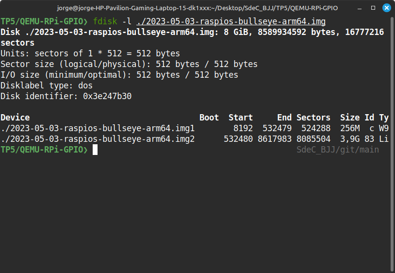
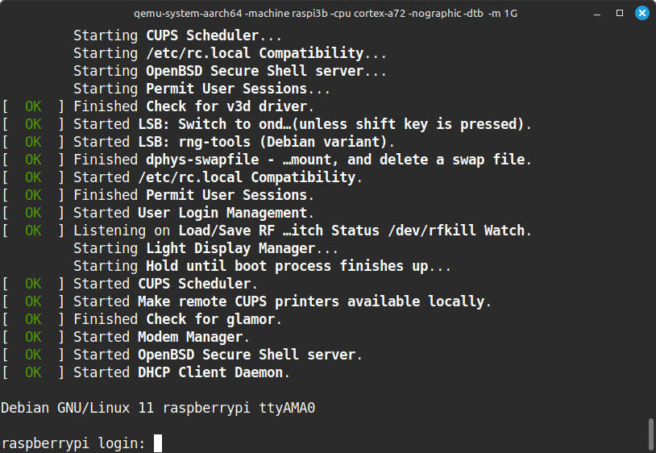
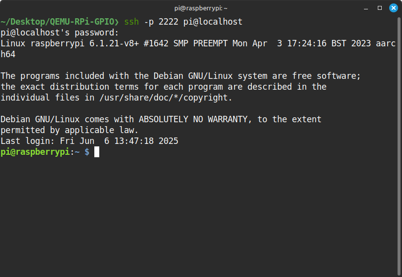
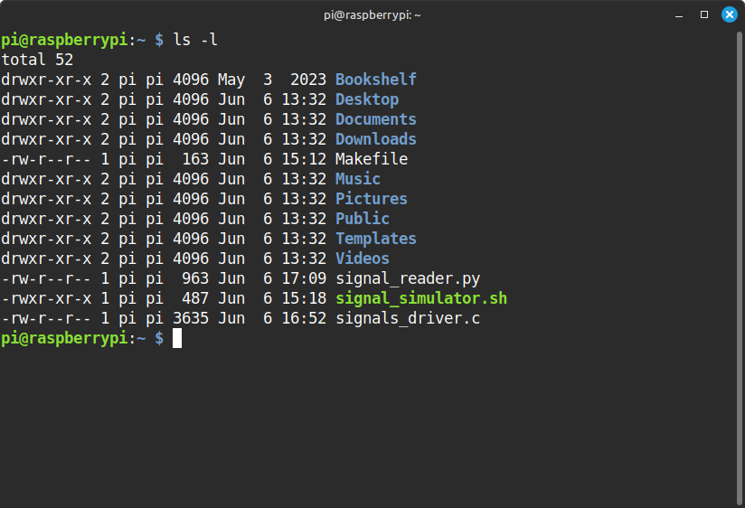
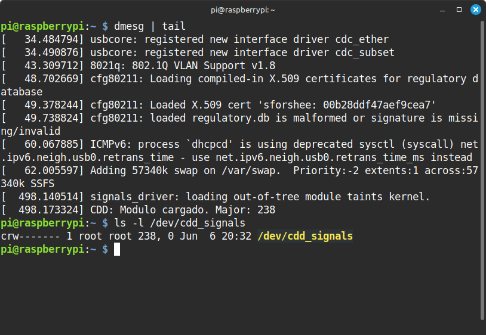
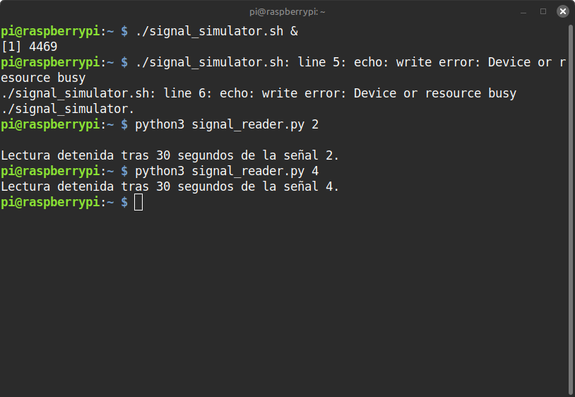
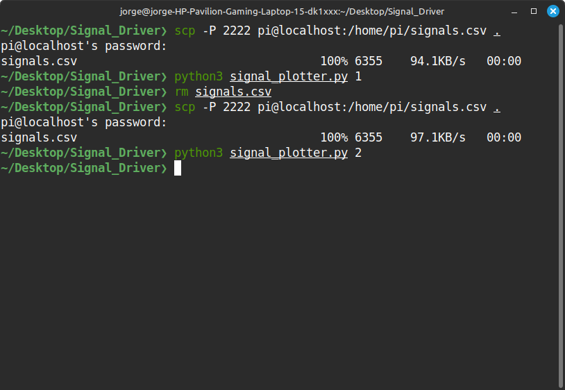
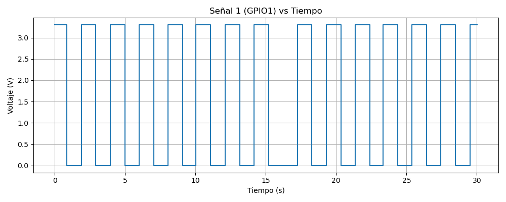
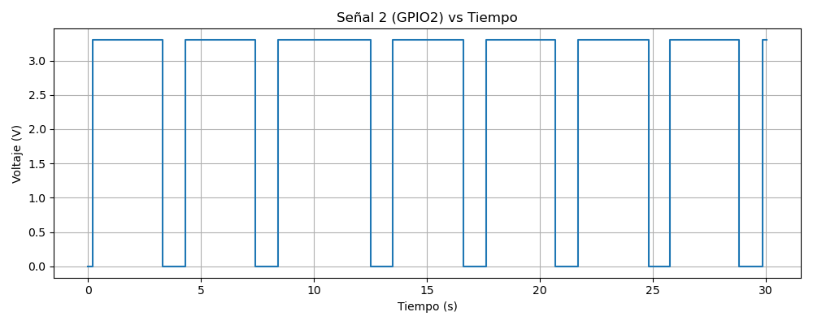

# Trabajo Práctico N°5: 
## DEVICE DRIVERS

**Nombres**  
_Jorge A. Arbach_; _Bianca A. Fraga_; _José I. López Sivilat_

**Grupo**: BJJ  
**Universidad Nacional de Córdoba**  
**Sistemas de Computación**

**Fecha**: 02/06/2025

---

### Información de los autores

- **Información de contacto**:  
  _jorge.arbach@mi.unc.edu.ar_;  
  _bianca.fraga@mi.unc.edu.ar_;  
  _jose.lopez.sivilat@mi.unc.edu.ar_.

---

# Introducción

En este informe se documenta el desarrollo de un dispositivo de caracter (CDD, Character Device Driver) en el sistema operativo Linux, cuya función principal es sensar dos señales externas a través de pines GPIO simulados en una Raspberry Pi 3B. La aplicación busca que se logre comprender e implementar desde cero un driver de Linux, simulando hardware en un entorno controlado.

Dado que no se dispone de una Raspberry Pi física, se utilizará QEMU para emular el entorno y validar el comportamiento tanto del driver como de las señales externas. El sistema también incluye una aplicación de usuario escrita en Python que permite graficar una de las señales en función del tiempo..

---

# Desarrollo

En primer lugar, se debe crear y configurar el entorno de QEMU para poder simular el hardware de una Raspberry Pi. Para realizar dicha tarea se hizo uso de una guia de instalación, referencidada en [1].

## 1. Preparación del Entorno QEMU

### 1.1 Archivos necesarios

* Imagen del sistema: `2023-05-03-raspios-bullseye-arm64.img`
* Kernel: `kernel8.img`
* DTB: `bcm2710-rpi-3-b-plus.dtb`

Para la obtención de dichos archivos se ejecutaron los siguientes comandos:

```bash
sudo apt-get install -y qemu-system-aarch64
wget https://downloads.raspberrypi.org/raspios_arm64/images/raspios_arm64-2023-05-03/2023-05-03-raspios-bullseye-arm64.img.xz
xz -d 2023-05-03-raspios-bullseye-arm64.img.xz
```

### 1.2 Montamos la iamgen
Una vez que tenemos la imagen la inspeccionamos para identificar las particiones:



Como podemos ver la primera partición es la partición de arranque. Debemos montarla para extraer archivos necesarios para el funcionamiento de QEMU. Para poder montar la imagen debemos caluclar el offset de la particion para saber donde arranca dicha imagen. Esto lo calculamos multiplicando el sector donde empieza la imagen por el tamaño de sector. En nuestro caso, el tamaño del sector es de 512 bytes, entonces el offset es 8192 * 512 = 4194304.

Una vez conocido el offset, montamos la imagen:
```bash
sudo mkdir /mnt/image
sudo mount -o loop,offset=4194304 ./2023-05-03-raspios-bullseye-arm64.img /mnt/image/
```

Si vemos los archivos del directorio montado, podemos ver archivos de booteo tipicos de una Raspberry Pi en `/boot`, asi como cmdline.txt y config.txt. Para correr  QEMU vamos a necesitar el archivo de kernel y device tree, asi que los copiamos en nuestro directorio de trabajo:

```bash
cp /mnt/image/bcm2710-rpi-3-b-plus.dtb .
cp /mnt/image/kernel8.img .
```

### 1.3 Configurando SSH

Necesitamos crear una contraseña nueva y poneral en el archivo de userconf en la particion de booteo. `userconf` espera un nombre de usuario y una contraseña hasheada, por lo que vamos a hacer uso de `openssl` para generar una contraseña segura.

Se ejecutan los siguientes comandos y se escribe una contraseña a elección:

```bash
$ openssl passwd -6
Password:
Verifying - Password:
$6$2GRpc2ysMAsTv4UC$dwxhalrQrvZ8oz8jUXGZx3xgJuZRXlIuVidweTP8W8lysFuDVxixZ74q/rUpP9k6UMoNrgA9u4sLachM4jCbp1
```

Una vez que obtenemos el hash, lo debemos insertar en ka imagen, junto con el usuario por defecto "pi":

```bash
$ echo 'pi:$6$2GRpc2ysMAsTv4UC$dwxhalrQrvZ8oz8jUXGZx3xgJuZRXlIuVidweTP8W8lysFuDVxixZ74q/rUpP9k6UMoNrgA9u4sLachM4jCbp1' | sudo tee /mnt/image/userconf
```

Y habilitamos SSH creando un archivo ssh vacio:
```bash
$ sudo touch /mnt/image/ssh
```

### 1.4 Resize de la imagen

Para poder correr la imagen de Raspberry Pi en Qemu necesitamos que la imagen tenga un tamaño equivalente a una potencia de 2, por lo cual debemos ajustar el tamaño de la misma. 

Podemos averiguar el tamaño de la imagen actual de la siguiente forma:

```bash
CURRENT_SIZE=$(stat -c%s "2023-05-03-raspios-bullseye-arm64.img")
```

Y luego se puede ejecutar un pequeño script en python para encontrar la próxima potencia de 2 más cercana:

```python
import math
print(2**(math.ceil(math.log(CURRENT_SIZE, 2))))
```

Conocido el tamaño el cual debe tener la imagen, procedemos a hacer el resize de la misma
```bash
qemu-img resize "2023-05-03-raspios-bullseye-arm64.img" "tamaño_calculado"
```

### 1.5 Corriendo QEMU

Una vez que tenemos todo estamos listo para iniciar QEMU haciendo uso de lo siguiente:

- imagen con el resize
- kernel y device tree extraidos
- Raspberry Pi 3B+ with 1GB of RAM and 4 cores
- configuración de la consola serial
- configuración del network para conectar SSH via el USB network adapter emulado

Corremos el comando:

```bash
qemu-system-aarch64 -machine raspi3b -cpu cortex-a72 -nographic -dtb bcm2710-rpi-3-b-plus.dtb -m 1G -smp 4 -kernel kernel8.img -sd 2023-05-03-raspios-bullseye-arm64.img -append "rw earlyprintk loglevel=8 console=ttyAMA0,115200 dwc_otg.lpm_enable=0 root=/dev/mmcblk0p2 rootdelay=1" -device usb-net,netdev=net0 -netdev user,id=net0,hostfwd=tcp::2222-:22
```



En una shell separada, ya se puede, mediante SSH, hacer uso de la Raspberry Pi emulada:
```bash
ssh -p 2222 pi@localhost
```



Esto permite iniciar el entorno, y acceder por SSH (puerto 2222) y tener salida de consola sin entorno gráfico.

### 1.5 Entorno en QEMU

Como debemos ejecutar todos dentro de la raspberry debemos transferir los archivos necesarios, ubicados en `Signal_Handler` desde la máquina anfitriona a la Raspberry Pi emulada con QEMU. 

Como ya se ha configurado red con reenvío de puertos (`hostfwd=tcp::2222-:22`), vamos a hacer uso de `scp` (Secure Copy) para transferir los archivos:


```bash
scp -P 2222 signals_driver.c Makefile pi@localhost:/home/pi/
scp -P 2222 signal_simulator.sh pi@localhost:/home/pi/
scp -P 2222 signal_reader.py pi@localhost:/home/pi/
scp -P 2222 Makefile pi@localhost:/home/pi/
```

Caber recordar que se debe hacer uso de la contraseña configurada en el 1.3.

Luego, en la Raspberry emulada ya se pueden ver los archivos en home:



## 2. Simulación de Señales Externas

Se creó un script que simula dos señales digitales diferentes en los pines GPIO1 y GPIO2 de la Raspberry Pi.

- **GPIO1** genera una señal cuadrada rápida (1 Hz).
- **GPIO2** genera pulsos más largos y menos frecuentes.

### Script: [signal_simulator.sh](https://github.com/Jorgear27/SdeC_BJJ/blob/main/TP5/signal-driver_TP/signal_simulator.sh)

1. **Exporta los GPIOs 1 y 2**  
```bash
echo 1 > /sys/class/gpio/export
echo 2 > /sys/class/gpio/export
```
Esto asegura que los GPIO1 y GPIO2 estén disponibles para ser usados desde el espacio de usuario.

2. **Configura los GPIOs como salida**  
Define ambos GPIOs como salidas digitales, para poder modificar el valor de los mismos:
```bash
echo out > /sys/class/gpio/gpio1/direction
echo out > /sys/class/gpio/gpio2/direction
```
   
En el hardware real dichos pines deben estar configurados como entrada, ya que estaremos sensando una señal externa.

3. **Bucle infinito para alternar señales**  
Entra en un bucle donde:
- **GPIO1**:  
  Cambia entre alto (`1`) y bajo (`0`) cada 0.5 segundos, generando una señal cuadrada de 1 Hz.
- **GPIO2**:  
  Permanece en alto durante 1.5 segundos, luego en bajo durante 0.5 segundos, generando un pulso más largo y menos frecuente.

Este script debe ejecutarse en segundo plano:

```bash
chmod +x signal_simulator.sh
./signal_simulator.sh &
```

## 3. Desarrollo del CDD (Character Device Driver)

### C Driver: [signlas_driver.c](https://github.com/Jorgear27/SdeC_BJJ/blob/main/TP5/signal-driver_TP/signals_driver.c)

Se desarrolló este driver que crea un dispositivo de caracteres que permite leer el estado de dos GPIOs alternables desde espacio de usuario, usando operaciones estándar de archivo. Se compila con un Makefile y se inserta/verifica con comandos estándar de módulos de Linux.

### **Como funciona el driver `cdd_signals.c`**

1. **Inicialización y limpieza**
- `cdd_init`:  
  - Reserva un número mayor/menor para el dispositivo. El número mayor identifica el driver en el kernel, y el menor identifica el dispositivo específico.
  - Inicializa y registra el dispositivo de caracteres (`cdev`).Se inicializa la estructura `cdev` y se registra con el sistema, asociando las operaciones de archivo (`fops`) que definen cómo responder a open, read, write, etc.
  - Crea la clase y el dispositivo en `/dev/cdd_signals`
  - Inicializa un timer que lee periódicamente el valor del GPIO seleccionado.
- `cdd_exit`:  
  - Libera el timer, los GPIOs, destruye el dispositivo y la clase, y libera el número mayor/menor.

2. **Creación de la clase y el dispositivo (CDF):**
- `cdd_class`:  
- `cdd_device`:  
  - Estas funciones crean una clase de dispositivo y un archivo de dispositivo en dev (el **CDF**), por ejemplo `/dev/cdd_signals`.  Esto permite que los programas de usuario puedan abrir, leer y escribir en `/dev/cdd_signals`, y esas operaciones se traducen en llamadas a las funciones del driver.
   
3. **Operaciones de archivo**
- `cdd_read`:  
  - Cuando un usuario lee `/dev/cdd_signals`, devuelve el valor actual (0 o 1) del GPIO seleccionado.
- `cdd_write`:  
  - Permite al usuario seleccionar qué señal leer (escribe '0' para GPIO 0 o '1' para GPIO 1).
- `cdd_open` y `cdd_release`:  
  - Funciones estándar para abrir/cerrar el dispositivo (no hacen nada especial aquí).

La estructura `file_operations fops` define cómo se comporta el driver cuando un usuario interactúa con el archivo de dispositivo.  
Por ejemplo, cuando se hace`cat /dev/cdd_signals`, el kernel llama a tu función `cdd_read`.

4. **Timer**
- `read_signal`:  
  - Se ejecuta cada segundo, lee el valor del GPIO seleccionado y lo guarda en `last_value`.

Entonces a modo de resumen, el vínculo entre CDD y CDF se realiza mediante la reserva de números mayor/menor, el registro del `cdev`, y la creación automática del archivo de dispositivo en dev usando `class_create` y `device_create`. Así, cualquier acceso al archivo en dev se traduce en llamadas al driver.

```
[Espacio de usuario]
        |
        v
/dev/cdd_signals  (CDF)
        |
        v
[CDD: Driver en kernel]
        |
        v
[Hardware GPIO]
```

#### _La compilación del módulo la realizamos mediante el [Makefile](https://github.com/Jorgear27/SdeC_BJJ/blob/main/TP5/signal-driver_TP/Makefile) presente en el repositorio_

### **Inserción del módulo**

Luego de compilar el driver se inserta dicho módulo en el kernel del dispositivo Raspberry Pi:
```sh
sudo insmod signals_driver.ko
sudo chmod 666 /dev/cdd_signals
```

Podemos verificar que el módulo está cagado correctamente verificando los logs del kernel:

```sh
dmesg | tail
```

Podemos ver el mensaje de éxito `CDD: Modulo cargado. Major: 238`

También podemos verificar que el dispositivo existe:
```sh
ls -l /dev/cdd_signals
```



### **¿Cómo se usa el modulo?**

- **Leer señal:**
  ```sh
  cat /dev/cdd_signals
  ```
- **Seleccionar señal:**
  ```sh
  echo 1 | sudo tee /dev/cdd_signals   # Selecciona GPIO 1
  echo 2 | sudo tee /dev/cdd_signals   # Selecciona GPIO 2
  ```

## 4. Registro y Graficación de Señales en Entornos Separados

Dado que la instalación del paquete `matplotlib` dentro de la Raspberry Pi emulada con QEMU resultó impráctica debido a limitaciones de recursos y dependencias, se optó por dividir el proceso en dos etapas separadas, ejecutadas en distintos entornos:

1. **Captura de datos dentro de la Raspberry Pi emulada (QEMU)**
2. **Graficación de los datos en la máquina host (Linux nativo)**

Esta separación permitió mantener el diseño modular y funcional del sistema, conservando la capacidad de analizar las señales desde el espacio de usuario sin necesidad de instalar librerías pesadas en el entorno restringido.

### 4.1 `signals_reader.py`: Captura de Señales en la Raspberry Pi Emulada

Este script es una aplicación de usuario que permite seleccionar y adquirir una de dos señales digitales disponibles a través de un driver de dispositivo de caracteres (CDD) en `/dev/cdd_signals`. Los datos adquiridos se almacenan en un archivo CSV para su posterior análisis o graficado.

#### Código del archivo [signals_reader.py](https://github.com/Jorgear27/SdeC_BJJ/blob/main/TP5/signal-driver_TP/signal_reader.py):

**Funcionamiento:**

- **Selección de señal:**  
  El usuario ejecuta el script indicando qué señal desea leer (por ejemplo, `python3 signal_reader.py 1` o `python3 signal_reader.py 2`). El script escribe este número en el archivo de dispositivo `/dev/cdd_signals`, lo que indica al driver del kernel cuál GPIO debe ser sensado.

- **Adquisición de datos:**  
  El script abre el archivo `/dev/cdd_signals` en modo lectura y, durante 30 segundos (o hasta que el usuario interrumpa con Ctrl+C), lee el valor de la señal seleccionada cada 0.1 segundos (10 Hz de muestreo). Cada lectura se guarda junto con una marca de tiempo en el archivo `signals.csv`.

- **Formato de salida:**  
  El archivo `signals.csv` contiene dos columnas: `timestamp` (marca de tiempo en segundos desde época UNIX) y `signal` (valor digital leído, típicamente 0 o 1).

- **Finalización:**  
  El proceso termina automáticamente tras 30 segundos o si el usuario lo interrumpe manualmente.



### 4.2 Extracción del Archivo CSV hacia la Máquina Host

Una vez generado el archivo CSV en la Raspberry Pi emulada, se lo transfiere al host para su posterior análisis y graficación:

```bash
scp -P 2222 pi@localhost:/home/pi/signals.csv .
```



### 4.3 `signals_plotter.py`: Graficación de Señales en la Máquina Host

Este script permite visualizar gráficamente los datos adquiridos y almacenados en `signals.csv`, facilitando el análisis visual de la señal sensada.

#### Código del archivo [signals_plotter.py](https://github.com/Jorgear27/SdeC_BJJ/blob/main/TP5/signal-driver_TP/signal_plotter.py):

**Funcionamiento:**

- **Lectura de datos:**  
  El script lee el archivo `signals.csv` generado por signal_reader.py usando la biblioteca `pandas`.

- **Procesamiento:**  
  - Calcula el tiempo relativo desde el inicio de la adquisición para el eje X.
  - Convierte el valor digital de la señal (0 o 1) a voltaje real multiplicando por el valor de VCC (por defecto, 3.3V), permitiendo así que el gráfico muestre la señal en unidades físicas.

- **Graficado:**  
  Utiliza `matplotlib` para graficar la señal en función del tiempo:




---

# Conclusiones

Este proyecto abordó el desarrollo y validación de un Character Device Driver (CDD) para el sensado de señales mediante GPIO en un entorno Linux embebido, sin depender de hardware físico. Utilizando QEMU para emular una Raspberry Pi 3B con arquitectura ARM64, se logró simular el comportamiento real del sistema.

Desde la preparación del entorno de emulación —incluyendo kernel, imagen del sistema operativo y acceso por SSH— hasta la creación de scripts que simulan señales cuadradas a través de GPIOs, el trabajo permitió ejercitar la interacción entre el espacio de usuario y el espacio del kernel en Linux. El driver de carácter diseñado permitió seleccionar entre dos señales externas y acceder a su valor en tiempo real desde una aplicación de usuario.

Durante la implementación se identificaron limitaciones del entorno emulado, como la imposibilidad de instalar librerías gráficas complejas como `matplotlib`. Este desafío fue abordado mediante un diseño desacoplado de los scrpits: uno que captura las señales y guarda los datos en un archivo CSV dentro de QEMU, y otro que, ya en la máquina host, permite visualizar la evolución temporal de las señales. Esta solución superó las restricciones del entorno e introdujo una metodología de trabajo modular y portable.

En resumen, el proyecto no solo consolidó conocimientos técnicos sobre desarrollo de drivers en Linux, sino que también se efectuaron prácticas sólidas de desarrollo y prueba en entornos virtualizados, resolución de problemas y separación de responsabilidades. Se demostró que es posible construir, validar y observar el comportamiento de sistemas embebidos incluso sin acceso a hardware físico, lo que es  clave para el desarrollo en sistemas de bajo nivel y software embebido.

# Referencias

- [1] https://interrupt.memfault.com/blog/emulating-raspberry-pi-in-qemu
- [2] https://www.raspberrypi.com/software/operating-systems/
